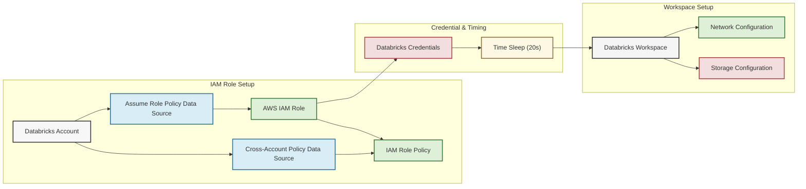

# 🔥 Databricks Workspace Module

This module provisions a **Databricks Workspace** in AWS using the **Databricks MWS (Managed Workspaces) API**. It sets up the required AWS IAM roles and policies for cross-account access, configures networking, storage, and credentials, and finally deploys a Databricks Workspace.

## 📖 Overview

This module connects key AWS components to create a secure environment for a Databricks Workspace. It establishes a dedicated IAM role with the appropriate cross-account policies, configures a VPC, including private subnets and security groups, to support safe cluster communication, and integrates a dedicated S3 storage configuration for workspace data. A built-in pause, taken from the official examples, ensures that workspace credentials are properly validated before the environment goes live.



## 🛠 Resources Used

| Resource / Data Source                                                                                                                                                   | Description                                                               | Documentation                                                                                                    |
| ------------------------------------------------------------------------------------------------------------------------------------------------------------------------ | ------------------------------------------------------------------------- | ---------------------------------------------------------------------------------------------------------------- |
| [**`aws_iam_role`**](https://registry.terraform.io/providers/hashicorp/aws/latest/docs/resources/iam_role)                                                               | Creates a cross-account IAM role for Databricks                           | [IAM Role](https://docs.aws.amazon.com/IAM/latest/UserGuide/id_roles.html)                                       |
| [**`aws_iam_role_policy`**](https://registry.terraform.io/providers/hashicorp/aws/latest/docs/resources/iam_role_policy)                                                 | Attaches a policy to the cross-account IAM role                           | [IAM Role Policy](https://docs.aws.amazon.com/IAM/latest/UserGuide/access_policies.html)                         |
| [**`databricks_mws_networks`**](https://registry.terraform.io/providers/databricks/databricks/latest/docs/resources/mws_networks)                                        | Configures Databricks network settings (VPC, private subnets, SGs)        | [MWS Networks](https://docs.databricks.com/administration-guide/account-settings/mws-networks.html)              |
| [**`databricks_mws_storage_configurations`**](https://registry.terraform.io/providers/databricks/databricks/latest/docs/resources/mws_storage_configurations)            | Sets up storage configuration for Databricks using an S3 bucket           | [MWS Storage Configurations](https://docs.databricks.com/administration-guide/account-settings/mws-storage.html) |
| [**`databricks_mws_credentials`**](https://registry.terraform.io/providers/databricks/databricks/latest/docs/resources/mws_credentials)                                  | Provisions credentials for the Databricks workspace deployment            | [MWS Credentials](https://docs.databricks.com/administration-guide/account-settings/mws-credentials.html)        |
| [**`databricks_mws_workspaces`**](https://registry.terraform.io/providers/databricks/databricks/latest/docs/resources/mws_workspaces)                                    | Creates the Databricks Workspace using the configured network and storage | [MWS Workspaces](https://docs.databricks.com/administration-guide/account-settings/mws-workspaces.html)          |
| [\*\*`databricks_aws_assume_role_policy` (Data Source)](https://registry.terraform.io/providers/databricks/databricks/latest/docs/data-sources/aws_assume_role_policy)   | Generates the assume role policy JSON for Databricks                      | [Assume Role Policy](https://docs.databricks.com/administration-guide/account-settings/mws-iam.html)             |
| [\*\*`databricks_aws_crossaccount_policy` (Data Source)](https://registry.terraform.io/providers/databricks/databricks/latest/docs/data-sources/aws_crossaccount_policy) | Retrieves the cross-account policy JSON for Databricks                    | [Cross-account Policy](https://docs.databricks.com/administration-guide/account-settings/mws-iam.html)           |
| [**`time_sleep`**](https://registry.terraform.io/providers/hashicorp/time/latest/docs/resources/sleep)                                                                   | Implements a delay to avoid credential validation race conditions         | [Time Sleep](https://registry.terraform.io/providers/hashicorp/time/latest/docs/resources/sleep)                 |

## ⚙️ Usage

Include this module in your Terraform configuration:

```hcl
module "databricks" {
  source                = "./modules/databricks"
  databricks_account_id = "1234567890123456"
  prefix                = "myproject"
  region                = "eu-central-1"
  tags                  = {
    Environment = "prod"
    Owner       = "data-team"
  }
  vpc_id                = "vpc-0abcd1234efgh5678"
  private_subnets       = ["subnet-0123456789abcdef0", "subnet-0fedcba9876543210"]
  sg_id                 = "sg-0123abcd4567efgh8"
  s3_bucket             = "my-databricks-bucket"
  iam_role_arn          = "arn:aws:iam::123456789012:role/my-databricks-role"
}
```

## 🔑 Inputs

| Name                    | Description                                                        | Type         | Default        | Required |
| ----------------------- | ------------------------------------------------------------------ | ------------ | -------------- | :------: |
| `databricks_account_id` | Databricks Account ID                                              | string       | n/a            |  ✅ Yes  |
| `prefix`                | Prefix for resource names                                          | string       | n/a            |  ✅ Yes  |
| `region`                | AWS region for the Databricks Workspace                            | string       | "eu-central-1" |  ❌ No   |
| `tags`                  | Common tags for all resources                                      | map(string)  | n/a            |  ✅ Yes  |
| `vpc_id`                | VPC ID for network configuration                                   | string       | n/a            |  ✅ Yes  |
| `private_subnets`       | List of private subnet IDs to be used in the network configuration | list(string) | n/a            |  ✅ Yes  |
| `sg_id`                 | Security Group ID for Databricks clusters                          | string       | n/a            |  ✅ Yes  |
| `s3_bucket`             | S3 bucket name for the storage configuration                       | string       | n/a            |  ✅ Yes  |
| `iam_role_arn`          | IAM Role ARN to be used for Databricks credentials                 | string       | n/a            |  ✅ Yes  |

## 📤 Outputs

| Name            | Description                                |
| --------------- | ------------------------------------------ |
| `workspace_id`  | The ID of the created Databricks Workspace |
| `workspace_url` | The URL to access the Databricks Workspace |
| `role_arn`      | ARN of the cross-account IAM role          |
