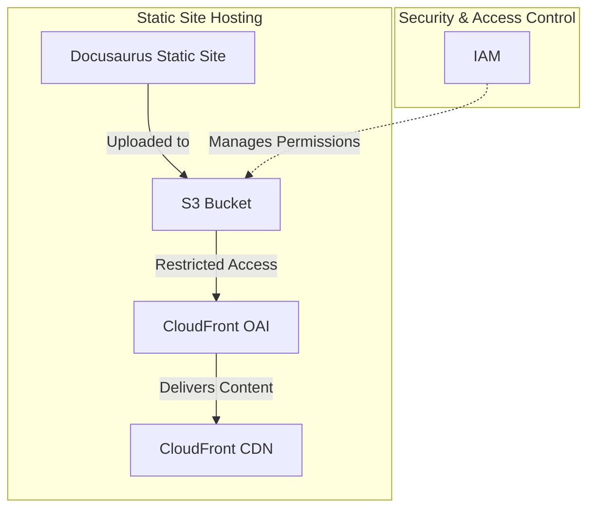

# 📖 Docusaurus S3 Module

This module provisions an **Amazon S3 bucket** for hosting a **Docusaurus static website**, enforcing strict security by restricting public access and allowing access only through **CloudFront's Origin Access Identity (OAI)**.

## 📖 Overview

Docusaurus is a static site generator optimized for **documentation and blogs**. Hosting it on **Amazon S3** provides a scalable and cost-efficient solution, while **CloudFront integration** ensures fast and secure content delivery.



## 🛠 Resources Used

| Resource | Description | Documentation |
|----------|-------------|---------------|
| `aws_s3_bucket` | Creates an S3 bucket for website hosting | [AWS S3 Bucket](https://registry.terraform.io/providers/hashicorp/aws/latest/docs/resources/s3_bucket) |
| `aws_s3_bucket_public_access_block` | Prevents public access to the bucket | [AWS S3 Public Access Block](https://registry.terraform.io/providers/hashicorp/aws/latest/docs/resources/s3_bucket_public_access_block) |
| `aws_s3_bucket_policy` | Restricts access to CloudFront OAI | [AWS S3 Bucket Policy](https://registry.terraform.io/providers/hashicorp/aws/latest/docs/resources/s3_bucket_policy) |

## ⚙️ Usage

To deploy this module, include the following Terraform configuration:

```hcl
module "docusaurus_s3" {
  source                  = "../../modules/docusaurus-s3"
  bucket_name             = "my-docusaurus-site"
  aws_region              = "eu-central-1"
  oai_canonical_user_id   = "my_oai_user_id"
}
```

## 🔑 Inputs

| Name                  | Description | Type   | Default | Required |
|-----------------------|-------------|--------|---------|----------|
| bucket_name           | Name of the S3 bucket | `string` | n/a | ✅ Yes |
| aws_region            | AWS region for deployment | `string` | `eu-central-1` | ❌ No |
| oai_canonical_user_id | CloudFront OAI canonical user ID | `string` | n/a | ✅ Yes |

## 📤 Outputs

| Name                  | Description |
|-----------------------|-------------|
| bucket_name           | The name of the created S3 bucket |
| s3_bucket_rest_endpoint | The S3 REST endpoint for CloudFront integration |

## 🌍 Notes

- The **S3 bucket does not enable website hosting mode**, as CloudFront is used for delivery.
- Ensure that **CloudFront is properly configured** to serve content from the S3 bucket.
- **Docusaurus static files must be uploaded manually or via CI/CD pipelines**.

