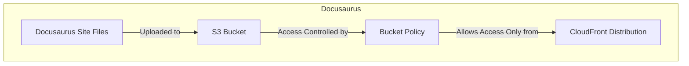

# 📖 Docusaurus S3 Module (with CloudFront Restriction)

This module provisions an **Amazon S3 bucket** for hosting a Docusaurus static website. The bucket is created as a private resource with all public access blocked. A bucket policy is attached to allow read-only access only when requests originate from a specific CloudFront distribution. This design ensures that the S3 bucket remains private and that all public access is routed through CloudFront.

## 📖 Overview

Docusaurus is a static site generator optimized for documentation and blogs. This module creates a private S3 bucket and applies a bucket policy that permits access only from a CloudFront distribution—using the CloudFront service principal with a condition that the request's source ARN matches the provided CloudFront distribution ARN. This ensures that your site content is served securely via CloudFront.



## 🛠 Resources Used

| Resource                                      | Description                                                                              | Documentation |
|-----------------------------------------------|------------------------------------------------------------------------------------------|---------------|
| `aws_s3_bucket`                               | Creates an S3 bucket for hosting the static website                                      | [AWS S3 Bucket](https://registry.terraform.io/providers/hashicorp/aws/latest/docs/resources/s3_bucket) |
| `aws_s3_bucket_public_access_block`           | Blocks public access to the S3 bucket                                                    | [AWS S3 Public Access Block](https://registry.terraform.io/providers/hashicorp/aws/latest/docs/resources/s3_bucket_public_access_block) |
| `aws_s3_bucket_policy`                        | Attaches a bucket policy that restricts access to requests from a specific CloudFront distribution | [AWS S3 Bucket Policy](https://registry.terraform.io/providers/hashicorp/aws/latest/docs/resources/s3_bucket_policy) |

## ⚙️ Usage

Example configuration in your root module:

```hcl
module "docusaurus_s3" {
  source                      = "../../modules/docusaurus-s3"
  bucket_name                 = "my-docusaurus-site"
  cloudfront_distribution_arn = module.cloudfront.cloudfront_distribution_arn
}
```

## 🔑 Inputs

| Name                          | Description                                                                           | Type     | Default    | Required |
|-------------------------------|---------------------------------------------------------------------------------------|----------|------------|:--------:|
| bucket_name                   | The name of the S3 bucket for hosting the site.                                       | string   | n/a        | Yes      |
| cloudfront_distribution_arn   | The ARN of the CloudFront distribution that is permitted to access the S3 bucket.        | string   | n/a        | Yes      |

## 📤 Outputs

| Name                     | Description                                                           |
|--------------------------|-----------------------------------------------------------------------|
| bucket_name              | The S3 bucket name.                                                   |

## 🌍 Notes

- The **S3 bucket does not enable website hosting mode**, as CloudFront is used for delivery.
- Ensure that **CloudFront is properly configured** to serve content from the S3 bucket.
- **Docusaurus static files must be uploaded manually or via CI/CD pipelines**.

