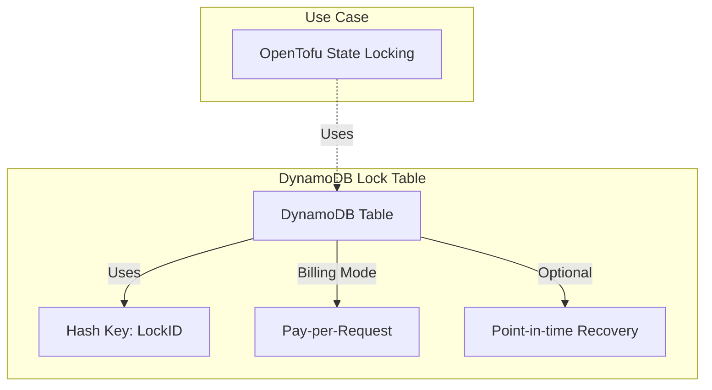

# 🗄️ DynamoDB Module

This module creates a simple yet effective Amazon DynamoDB table designed specifically for OpenTofu/Terraform state locking.

## 📖 Overview

When multiple team members run infrastructure operations simultaneously, race conditions can corrupt your state files. This module sets up a DynamoDB table that provides reliable, low-latency locking to prevent concurrent state modifications.



## 🛠 Resources Used

| Resource             | Description                          | Documentation                                                                                              |
| -------------------- | ------------------------------------ | ---------------------------------------------------------------------------------------------------------- |
| `aws_dynamodb_table` | Creates a DynamoDB table for locking | [AWS DynamoDB](https://registry.terraform.io/providers/hashicorp/aws/latest/docs/resources/dynamodb_table) |

## ⚙️ Usage

Add the module to your Terraform/OpenTofu configuration:

```hcl
module "state_lock" {
  source     = "../../modules/dynamodb"
  table_name = "terraform-state-lock"
}
```

Then reference it in your backend configuration:

```hcl
terraform {
  backend "s3" {
    bucket         = "your-terraform-state"
    key            = "terraform.tfstate"
    region         = "eu-central-1"
    dynamodb_table = "terraform-state-lock"
    encrypt        = true
  }
}
```

## 🔑 Inputs

| Name                            | Description                                          | Type          | Default | Required |
| ------------------------------- | ---------------------------------------------------- | ------------- | ------- | :------: |
| `table_name`                    | The name of the DynamoDB table to create             | `string`      | n/a     |  ✅ Yes  |
| `tags`                          | Tags to apply to all resources                       | `map(string)` | `{}`    |  ❌ No   |
| `enable_point_in_time_recovery` | Enable point-in-time recovery for the DynamoDB table | `bool`        | `false` |  ❌ No   |

## 📤 Outputs

| Name         | Description                    |
| ------------ | ------------------------------ |
| `table_id`   | The ID of the DynamoDB table   |
| `table_arn`  | The ARN of the DynamoDB table  |
| `table_name` | The name of the DynamoDB table |
