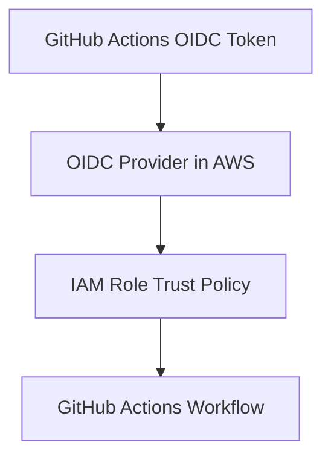

# 🔐 OIDC Module

This module configures an AWS OpenID Connect (OIDC) provider for GitHub Actions and creates an IAM role that can be assumed using OIDC tokens. By leveraging OIDC authentication, you can eliminate the need for storing long-lived AWS credentials in your repositories.

## 📖 Overview

This module performs **registers an OIDC Provider**, i.e. creates (or ensures the existence of) an AWS IAM OIDC provider using GitHub Actions' OIDC endpoint (`https://token.actions.githubusercontent.com`). Additionally, it will **create an IAM Role** , with a trust policy that restricts access to a specific GitHub repository and branch, enabling GitHub Actions workflows to assume this role securely. Finally, the policy is attached with required permissions. The IAM role is granted permissions for VPC, S3, CloudFront, Timestream, Kinesis and other relevant actions.



## 🛠 Resources Used

| Resource                                                                                                                                     | Description                                                                                                       | Documentation                                                                                                                                                         |
| -------------------------------------------------------------------------------------------------------------------------------------------- | ----------------------------------------------------------------------------------------------------------------- | --------------------------------------------------------------------------------------------------------------------------------------------------------------------- |
| [`aws_iam_openid_connect_provider`](https://registry.terraform.io/providers/hashicorp/aws/latest/docs/resources/iam_openid_connect_provider) | Registers the GitHub Actions OIDC provider in AWS.                                                                | [OIDC Provider](https://docs.github.com/en/actions/security-for-github-actions/security-hardening-your-deployments/configuring-openid-connect-in-amazon-web-services) |
| [`aws_iam_role`](https://registry.terraform.io/providers/hashicorp/aws/latest/docs/resources/iam_role)                                       | Creates an IAM role with a trust policy allowing GitHub Actions to assume it via OIDC.                            | [IAM Role](https://docs.aws.amazon.com/IAM/latest/UserGuide/id_roles.html)                                                                                            |
| [`aws_iam_policy`](https://registry.terraform.io/providers/hashicorp/aws/latest/docs/resources/iam_policy)                                   | Defines an inline IAM policy with permissions for VPC, S3, CloudFront, Timestream, Kinesis, IoT, and IAM actions. | [IAM Policy](https://docs.aws.amazon.com/IAM/latest/UserGuide/access_policies_create-console.html)                                                                    |
| [`aws_iam_role_policy_attachment`](https://registry.terraform.io/providers/hashicorp/aws/latest/docs/resources/iam_role_policy_attachment)   | Attaches the generated policy to the IAM role.                                                                    | [Policy Attachment](https://docs.aws.amazon.com/IAM/latest/UserGuide/access_policies_job-functions_create-policies.html)                                              |

## ⚙️ Usage

Include this module in your Terraform configuration as follows:

```hcl
module "oidc" {
  source             = "./iam-oidc"  # Adjust the module path as needed.
  role_name          = "GitHubActionsDeployRole"
  repository         = "myorg/myrepo"
  branch             = "main"
}

output "github_oidc_role_arn" {
  value = module.oidc.role_arn
}
```

This configuration creates an OIDC provider (if not already present) and an IAM role that GitHub Actions can assume via OIDC. The trust policy is limited to workflows originating from the specified repository and branch. The role will have permissions to manage infrastructure related to infrastructure modules.

## 🔑 Inputs

| Name                | Description                                                                                                   | Type           | Default                                         | Required |
| ------------------- | ------------------------------------------------------------------------------------------------------------- | -------------- | ----------------------------------------------- | :------: |
| `oidc_provider_url` | The URL of the OIDC provider. For GitHub Actions, use `https://token.actions.githubusercontent.com`.          | `string`       | `"https://token.actions.githubusercontent.com"` |    No    |
| `client_id_list`    | List of client IDs for the OIDC provider. Typically includes `sts.amazonaws.com`.                             | `list(string)` | `["sts.amazonaws.com"]`                         |    No    |
| `thumbprint_list`   | SHA-1 thumbprint(s) of the OIDC provider's TLS certificate, as a lowercase hexadecimal string without colons. | `list(string)` | `["6938fd4d98bab03faadb97b34396831e3780aea1"]`  |    No    |
| `role_name`         | The name of the IAM role to create.                                                                           | `string`       | n/a                                             |   Yes    |
| `repository`        | The GitHub repository in the format `owner/repo` that is allowed to assume the role.                          | `string`       | n/a                                             |   Yes    |
| `branch`            | The branch that is allowed to assume the role.                                                                | `string`       | `"main"`                                        |    No    |

## 📤 Outputs

| Name                | Description                                           |
| ------------------- | ----------------------------------------------------- |
| `oidc_provider_arn` | The ARN of the created OIDC provider.                 |
| `role_arn`          | The ARN of the IAM role that can be assumed via OIDC. |

## 🌍 Notes

- **Thumbprint:**  
  The thumbprint is a SHA-1 hash of the TLS certificate used by the OIDC provider. For GitHub Actions, you can retrieve it using OpenSSL. If the provider rotates its certificate, update the thumbprint accordingly.

  Example command to retrieve the thumbprint:

  ```bash
  echo | openssl s_client -servername token.actions.githubusercontent.com -connect token.actions.githubusercontent.com:443 2>/dev/null | openssl x509 -fingerprint -noout | sed 's/://g' | tr 'A-Z' 'a-z'
  ```
