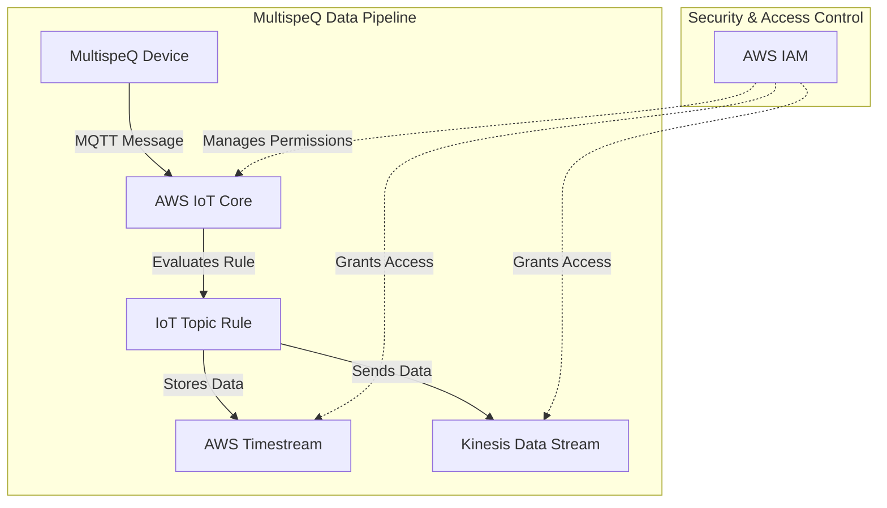

# 📡 IoT Core Module

This module provisions **AWS IoT Core** resources to allow MultispeQ devices to securely interface with the OpenJII Platform. In addition to storing data in **Timestream** for querying, the module also routes data to a **Kinesis Data Stream** for real‑time processing.

## 📖 Overview

AWS IoT Core enables **secure communication** between IoT devices and AWS cloud services. This module sets up an **IoT policy**, **IAM roles and policies**, and an **IoT Topic Rule** that routes device messages to both a **Timestream database** and a **Kinesis Data Stream**.



## 🛠 Resources Used

| Resource             | Description                                                              | Documentation                                                                                                    |
| -------------------- | ------------------------------------------------------------------------ | ---------------------------------------------------------------------------------------------------------------- |
| `aws_iot_policy`     | Defines permissions for IoT devices                                      | [AWS IoT Policy](https://registry.terraform.io/providers/hashicorp/aws/latest/docs/resources/iot_policy)         |
| `aws_iam_role`       | IAM roles for IoT to write to Timestream and Kinesis                       | [AWS IAM Role](https://registry.terraform.io/providers/hashicorp/aws/latest/docs/resources/iam_role)             |
| `aws_iam_policy`     | IAM policies defining allowed actions on Timestream and Kinesis            | [AWS IAM Policy](https://registry.terraform.io/providers/hashicorp/aws/latest/docs/resources/iam_policy)         |
| `aws_iot_topic_rule` | MQTT rule to filter and route IoT messages to multiple destinations        | [AWS IoT Topic Rule](https://registry.terraform.io/providers/hashicorp/aws/latest/docs/resources/iot_topic_rule) |

## ⚙️ Usage

To deploy this IoT Core module, include the following Terraform configuration:

```hcl
module "your_iot_core" {
  source                     = "../../modules/iot-core"
  policy_name                = "iot-policy"
  iot_timestream_role_name   = "iot-timestream-role"
  iot_timestream_policy_name = "iot-timestream-policy"
  iot_kinesis_role_name      = "iot-kinesis-role"
  iot_kinesis_policy_name    = "iot-kinesis-policy"
  rule_name                  = "iot-dual-rule"
  topic_filter               = "sensors/+/data"
  timestream_database        = "sensor_data_db"
  timestream_table           = "device_metrics"
  kinesis_stream_name        = "iot-kinesis-stream"
  kinesis_stream_arn         = "arn:aws:kinesis:us-east-1:123456789012:stream/iot-kinesis-stream"
}
```

## 🔑 Inputs

| Name                       | Description                                            | Type     | Default          | Required |
| -------------------------- | ------------------------------------------------------ | -------- | ---------------- | -------- |
| policy_name                | Name for the IoT policy                                | `string` | n/a              | ✅ Yes   |
| iot_timestream_role_name   | Name for the IAM role for IoT to write to Timestream   | `string` | n/a              | ✅ Yes   |
| iot_timestream_policy_name | Name for the IAM policy for IoT to write to Timestream | `string` | n/a              | ✅ Yes   |
| iot_kinesis_role_name      | Name for the IAM role for IoT to write to Kinesis      | `string` | n/a              | ✅ Yes   |
| iot_kinesis_policy_name    | Name for the IAM policy for IoT to write to Kinesis    | `string` | n/a              | ✅ Yes   |
| rule_name                  | Name for the IoT topic rule                            | `string` | n/a              | ✅ Yes   |
| topic_filter               | MQTT topic filter for the IoT rule                     | `string` | n/a              | ❌ No    |
| timestream_database        | Name of the Timestream database                        | `string` | n/a              | ✅ Yes   |
| timestream_table           | Name of the Timestream table                           | `string` | n/a              | ✅ Yes   |
| kinesis_stream_name        | Name of the Kinesis Data Stream                        | `string` | n/a              | ✅ Yes   |
| kinesis_stream_arn         | ARN of the Kinesis Data Stream                         | `string` | n/a              | ✅ Yes   |

## 📤 Outputs

| Name                    | Description                                                  |
| ----------------------- | ------------------------------------------------------------ |
| iot_policy_arn          | ARN of the IoT policy                                        |
| iot_timestream_role_arn | ARN of the IAM role allowing IoT Core to write to Timestream |
| iot_kinesis_role_arn    | ARN of the IAM role allowing IoT Core to write to Kinesis    |
| iot_topic_rule_name     | Name of the IoT Topic Rule                                   |

## 🌍 Notes

- The topic rule listens for messages matching the specified **MQTT topic filter**.
- The rule extracts the **deviceId** from the topic and stores data with this identifier in Timestream.
- Simultaneously, the same message is sent to a Kinesis Data Stream for further processing.
