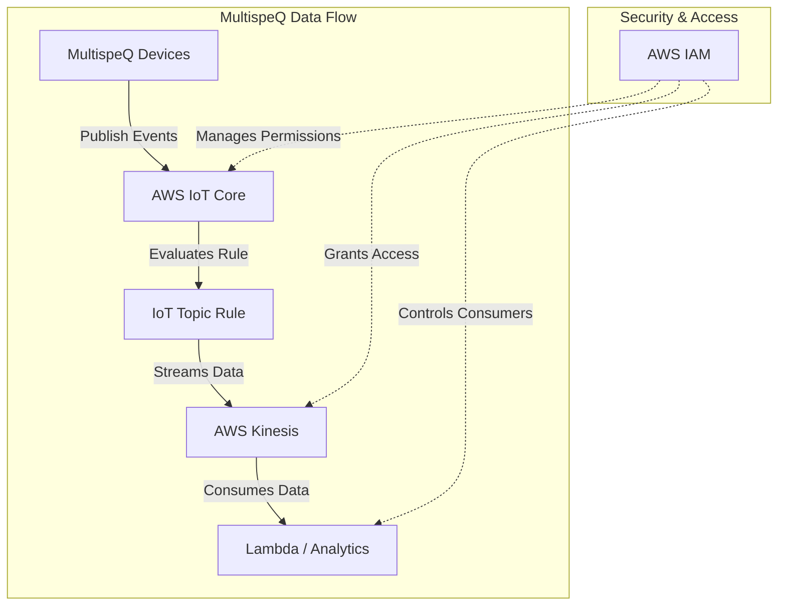

# 📢 Kinesis Data Stream Module

This module provisions an **AWS Kinesis Data Stream** for high-throughput, real-time data processing. It enables seamless integration with AWS services like **IoT Core, Lambda, and Databricks** to handle streaming data efficiently.

## 📖 Overview

AWS Kinesis Data Streams allow real-time streaming of large-scale data, enabling applications to **process, analyze, and react to events** as they happen. This module provisions a Kinesis stream with customizable **shard count** and **retention settings**.



## 🛠 Resources Used

| Resource             | Description                                    | Documentation                                                                                                    |
| -------------------- | ---------------------------------------------- | ---------------------------------------------------------------------------------------------------------------- |
| `aws_kinesis_stream` | Manages a Kinesis data stream                  | [AWS Kinesis Stream](https://registry.terraform.io/providers/hashicorp/aws/latest/docs/resources/kinesis_stream) |
| `aws_iam_role`       | IAM role allowing IoT Core to write to Kinesis | [AWS IAM Role](https://registry.terraform.io/providers/hashicorp/aws/latest/docs/resources/iam_role)             |
| `aws_iam_policy`     | IAM policy defining actions on Kinesis stream  | [AWS IAM Policy](https://registry.terraform.io/providers/hashicorp/aws/latest/docs/resources/iam_policy)         |

## ⚙️ Usage

To deploy this Kinesis module, include the following Terraform configuration:

```hcl
module "kinesis" {
  source                  = "../../modules/kinesis"
  stream_name             = "iot-kinesis-stream"
  shard_count             = 1
  retention_period_hours  = 24
}
```

## 🔑 Inputs

| Name                   | Description                            | Type     | Default | Required |
| ---------------------- | -------------------------------------- | -------- | ------- | -------- |
| stream_name            | Name of the Kinesis Data Stream        | `string` | n/a     | ✅ Yes   |
| shard_count            | Number of shards in the Kinesis stream | `number` | `1`     | ❌ No    |
| retention_period_hours | Data retention period in hours         | `number` | `24`    | ❌ No    |

## 📤 Outputs

| Name                | Description                            |
| ------------------- | -------------------------------------- |
| kinesis_stream_arn  | ARN of the Kinesis Data Stream         |
| kinesis_stream_name | Name of the provisioned Kinesis stream |

## 🌍 Notes

- Kinesis **scales horizontally** by increasing shard count; ensure proper partition key distribution for optimal performance.
