# 🔒 Macro Lambda Module

This module provisions **isolated Lambda functions** for executing user-submitted macros (scripts) in individual **Firecracker microVMs**. One function is created per configured language runtime, with a defense-in-depth security model.

## 📖 Overview

Each macro execution runs in its own Firecracker microVM via AWS Lambda. The module creates a shared IAM execution role, per-language CloudWatch log groups, and Lambda functions deployed from container images stored in ECR. A consumer IAM policy is also created for backends that need `lambda:InvokeFunction` access.

The module is **language-agnostic** — pass any number of languages via `var.languages` and the module scales automatically with zero code changes.

```mermaid
graph TB
    BACKEND["🖥 Backend ECS Task"] -->|"lambda:InvokeFunction<br/>(IAM-authenticated)"| FN

    subgraph ISOLATED["Isolated VPC Subnets — no IGW, no NAT"]
        direction TB

        subgraph FNEACH["× N languages (for_each = var.languages)"]
            FN["⚡ Lambda Function<br/>Firecracker microVM<br/>container image from ECR"]
        end

        FN -->|"Hyperplane ENI"| SG["🔒 Security Group<br/>no inbound / HTTPS egress only"]
    end

    subgraph IAM["IAM Execution Role (shared)"]
        direction LR
        P1["✅ CloudWatch Logs<br/>CreateLogStream, PutLogEvents"]
        P2["✅ VPC ENI<br/>Create/Describe/Delete"]
        P3["✅ ECR Pull<br/>GetDownloadUrl, BatchGetImage"]
        P4["🚫 Explicit Deny<br/>S3, RDS, IAM, Lambda,<br/>+ 25 more services"]
    end

    FN -.->|"assumes"| IAM
    SG -->|"HTTPS only"| VPCE["VPC Endpoints<br/>CloudWatch Logs / ECR"]
    SG -.-x|"❌ blocked"| INTERNET["🌐 Internet"]

    FN -->|"writes logs"| CW["📋 CloudWatch Log Group<br/>/aws/lambda/macro-runner-{lang}-{env}"]
    FLOWLOGS["📊 VPC Flow Logs"] -->|"pattern: REJECT"| METRIC["📈 Rejected Traffic<br/>Metric Filter"]

    style ISOLATED fill:#fce4e4,stroke:#a94442,stroke-width:2px,color:#333
    style FNEACH fill:#e8f4fc,stroke:#31708f,stroke-width:1px,color:#333
    style IAM fill:#eaf6e5,stroke:#3c763d,stroke-width:2px,color:#333
    style P4 fill:#fce4e4,stroke:#a94442,stroke-width:1px,color:#333
    style SG fill:#fdf8e8,stroke:#8a6d3b,stroke-width:2px,color:#333
    style INTERNET fill:#fce4e4,stroke:#a94442,stroke-width:1px,color:#333
```



### Security Model (defense-in-depth)

| Layer | Mechanism                  | What It Prevents                                                              |
| ----- | -------------------------- | ----------------------------------------------------------------------------- |
| 1     | **Firecracker microVM**    | Kernel exploits stay in throwaway VM; read-only FS except `/tmp`              |
| 2     | **Network Isolation**      | Isolated VPC subnets — no IGW, no NAT, egress only to VPC endpoints           |
| 3     | **IAM Authentication**     | Only `lambda:InvokeFunction` principals can invoke                            |
| 4     | **IAM Zero-Trust**         | Execution role: only CloudWatch Logs + VPC ENI; explicit DENY on 30+ services |
| 5     | **Application Sandboxing** | Restricted builtins, per-item timeouts (1s), output size limits               |
| 6     | **Observability**          | VPC flow logs, Grafana alerts, rejected traffic metric                        |

## 🛠 Resources Created

| Resource                                                                                                                                                     | Description                                                | Docs                                                                                                   |
| ------------------------------------------------------------------------------------------------------------------------------------------------------------ | ---------------------------------------------------------- | ------------------------------------------------------------------------------------------------------ |
| [`aws_iam_role`](https://registry.terraform.io/providers/hashicorp/aws/latest/docs/resources/iam_role)                                                       | Shared Lambda execution role with 4 inline policies        | [Lambda Execution Role](https://docs.aws.amazon.com/lambda/latest/dg/lambda-intro-execution-role.html) |
| [`aws_cloudwatch_log_group`](https://registry.terraform.io/providers/hashicorp/aws/latest/docs/resources/cloudwatch_log_group)                               | One per language (`/aws/lambda/macro-runner-{lang}-{env}`) | [CloudWatch Logs](https://docs.aws.amazon.com/AmazonCloudWatch/latest/logs/)                           |
| [`aws_lambda_function`](https://registry.terraform.io/providers/hashicorp/aws/latest/docs/resources/lambda_function)                                         | Container-image Lambda, one per language                   | [Lambda Container Images](https://docs.aws.amazon.com/lambda/latest/dg/images-create.html)             |
| [`aws_lambda_function_event_invoke_config`](https://registry.terraform.io/providers/hashicorp/aws/latest/docs/resources/lambda_function_event_invoke_config) | Zero retries, 60s max event age                            | [Async Invocation](https://docs.aws.amazon.com/lambda/latest/dg/invocation-async.html)                 |
| [`aws_iam_policy`](https://registry.terraform.io/providers/hashicorp/aws/latest/docs/resources/iam_policy)                                                   | Consumer policy granting `lambda:InvokeFunction`           | [IAM Policies](https://docs.aws.amazon.com/IAM/latest/UserGuide/access_policies.html)                  |
| [`aws_cloudwatch_log_metric_filter`](https://registry.terraform.io/providers/hashicorp/aws/latest/docs/resources/cloudwatch_log_metric_filter)               | Rejected VPC traffic counter for Grafana alerting          | [Metric Filters](https://docs.aws.amazon.com/AmazonCloudWatch/latest/logs/MonitoringLogData.html)      |

## ⚙️ Usage

This module is not called directly — it is composed by the [`macro-runner`](../macro-runner) module, which creates ECR repositories and injects their URLs/ARNs:

```hcl
module "lambda" {
  source = "../macro-lambda"

  environment         = var.environment
  isolated_subnet_ids = var.isolated_subnet_ids
  lambda_sg_id        = var.lambda_sg_id

  languages = {
    python = {
      memory             = 1024
      timeout            = 65
      ecr_repository_url = module.ecr["python"].repository_url
      ecr_repository_arn = module.ecr["python"].repository_arn
    }
    js = {
      memory             = 512
      timeout            = 65
      ecr_repository_url = module.ecr["js"].repository_url
      ecr_repository_arn = module.ecr["js"].repository_arn
    }
  }

  flow_log_group_name = module.flow_logs.log_group_name
  log_retention_days  = 7

  tags = { Environment = "dev" }
}
```

## 🔑 Inputs

| Name                  | Description                                                     | Type                 | Default | Required |
| --------------------- | --------------------------------------------------------------- | -------------------- | ------- | :------: |
| `environment`         | Environment name (e.g., dev, staging, prod)                     | `string`             | —       |  ✅ Yes  |
| `isolated_subnet_ids` | Isolated subnet IDs (no IGW, no NAT) where Lambda functions run | `list(string)`       | —       |  ✅ Yes  |
| `lambda_sg_id`        | Security group ID for Lambda functions                          | `string`             | —       |  ✅ Yes  |
| `languages`           | Per-language config: memory, timeout, ECR URL + ARN             | `map(object({...}))` | —       |  ✅ Yes  |
| `flow_log_group_name` | CloudWatch log group name for VPC flow logs                     | `string`             | —       |  ✅ Yes  |
| `log_retention_days`  | CloudWatch log retention for Lambda logs                        | `number`             | `7`     |  ❌ No   |
| `tags`                | Additional tags for all resources                               | `map(string)`        | `{}`    |  ❌ No   |

## 📤 Outputs

| Name                | Description                                                                   |
| ------------------- | ----------------------------------------------------------------------------- |
| `function_names`    | Lambda function names keyed by language                                       |
| `invoke_policy_arn` | IAM policy ARN granting `lambda:InvokeFunction` — attach to backend task role |
