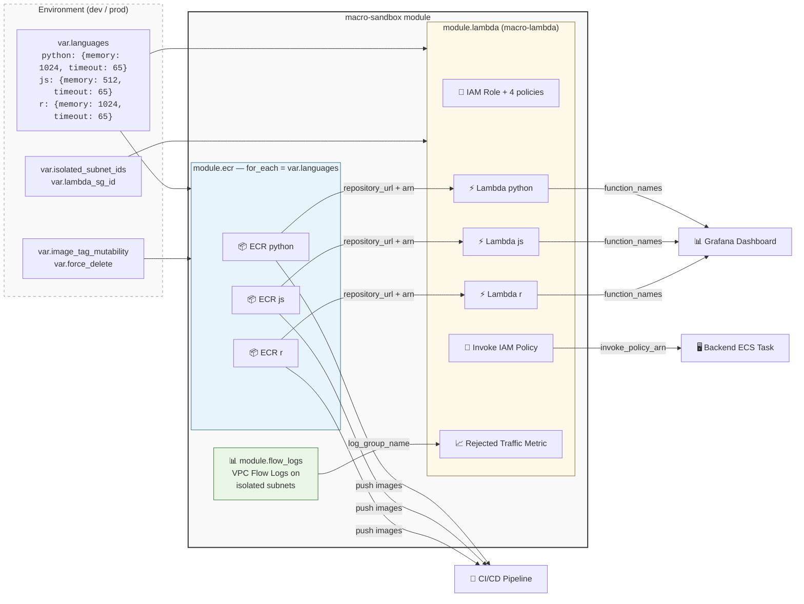

# 🏃 Macro Sandbox Module

This module orchestrates **isolated Lambda-based code execution** for user-submitted macros. It composes ECR repositories, VPC flow logs, and Lambda functions into a single deployable unit — one entry point for the complete macro execution infrastructure.

## 📖 Overview

The macro sandbox is an **orchestrator module** that wires together three sub-modules:

1. **ECR** (×N) — one container image registry per language
2. **VPC Flow Logs** — subnet-level traffic auditing for isolated subnets
3. **Macro Lambda** — IAM roles, Lambda functions, CloudWatch logs, invoke policy

The module is **language-agnostic** — add a new language by adding a key to `var.languages`. No module code changes required.



## 🛠 Sub-Modules Used

| Module                              | Purpose                                          | Source                     |
| ----------------------------------- | ------------------------------------------------ | -------------------------- |
| [`ecr`](../ecr)                     | Container image registry per language            | `for_each = var.languages` |
| [`vpc-flow-logs`](../vpc-flow-logs) | Traffic auditing on isolated subnets             | Single instance            |
| [`macro-lambda`](../macro-lambda)   | IAM, Lambda functions, CloudWatch, invoke policy | Single instance            |

## ⚙️ Usage

```hcl
module "macro_sandbox" {
  source = "../../modules/macro-sandbox"

  aws_region          = var.aws_region
  environment         = var.environment
  ci_cd_role_arn      = module.iam_oidc.role_arn
  isolated_subnet_ids = module.vpc.isolated_subnets
  lambda_sg_id        = module.vpc.macro_sandbox_lambda_security_group_id

  languages = {
    python = { memory = 1024, timeout = 65 } # numpy/scipy need ~1 GB
    js     = { memory = 512,  timeout = 65 } # Node.js is lightweight
    r      = { memory = 1024, timeout = 65 } # R + jsonlite needs decent memory
  }

  # Dev overrides
  image_tag_mutability = "MUTABLE"
  force_delete         = true
  log_retention_days   = 7

  tags = {
    Environment = var.environment
    Project     = "open-jii"
  }
}

# Grant backend the ability to invoke macro-sandbox functions
resource "aws_iam_role_policy_attachment" "backend_invoke" {
  role       = module.backend_ecs.task_role_name
  policy_arn = module.macro_sandbox.invoke_policy_arn
}
```

### Adding a new language

Add a key to `languages` — that's it:

```hcl
languages = {
  python = { memory = 1024, timeout = 65 }
  js     = { memory = 512,  timeout = 65 }
  r      = { memory = 1024, timeout = 65 }
  rust   = { memory = 256,  timeout = 30 } # new!
}
```

This creates a new ECR repo, Lambda function, CloudWatch log group, and updates all IAM policies automatically.

## 🔑 Inputs

| Name                      | Description                                                   | Type                             | Default       | Required |
| ------------------------- | ------------------------------------------------------------- | -------------------------------- | ------------- | :------: |
| `aws_region`              | AWS region for ECR repositories                               | `string`                         | —             |  ✅ Yes  |
| `environment`             | Environment name (e.g., dev, staging, prod)                   | `string`                         | —             |  ✅ Yes  |
| `ci_cd_role_arn`          | IAM role ARN used by CI/CD to push images to ECR              | `string`                         | —             |  ✅ Yes  |
| `isolated_subnet_ids`     | Isolated subnet IDs where Lambda functions run                | `list(string)`                   | —             |  ✅ Yes  |
| `lambda_sg_id`            | Security group ID for Lambda functions                        | `string`                         | —             |  ✅ Yes  |
| `languages`               | Per-language Lambda config (memory in MB, timeout in seconds) | `map(object({memory, timeout}))` | —             |  ✅ Yes  |
| `image_tag_mutability`    | ECR tag mutability (`MUTABLE` for dev, `IMMUTABLE` for prod)  | `string`                         | `"IMMUTABLE"` |  ❌ No   |
| `force_delete`            | Allow ECR deletion with images (true for dev, false for prod) | `bool`                           | `false`       |  ❌ No   |
| `log_retention_days`      | CloudWatch log retention for Lambda logs (days)               | `number`                         | `7`           |  ❌ No   |
| `flow_log_retention_days` | CloudWatch log retention for VPC flow logs (days)             | `number`                         | `14`          |  ❌ No   |
| `tags`                    | Additional tags for all resources                             | `map(string)`                    | `{}`          |  ❌ No   |

## 📤 Outputs

| Name                | Description                                                                              |
| ------------------- | ---------------------------------------------------------------------------------------- |
| `function_names`    | Lambda function names keyed by language (e.g., `{ python = "macro-sandbox-python-dev" }`) |
| `invoke_policy_arn` | IAM policy ARN granting `lambda:InvokeFunction` — attach to backend task role            |
