# ☁️ OpenNext CloudFront Module

This module creates a CloudFront distribution optimized for OpenNext deployments.

## 📖 Overview

This module creates a CloudFront distribution specifically designed for Next.js applications deployed with OpenNext. It provides global content delivery with multiple origins optimized for different content types and implements cache behaviors that understand Next.js routing patterns.

The distribution automatically handles static assets from S3, server-side rendered content from Lambda functions, and image optimization, providing a seamless experience for users worldwide.

```mermaid
graph TD;
    subgraph "CloudFront Distribution"
        CF[CloudFront Distribution]
        OAC[Origin Access Control]
        CFH[CloudFront Function]
    end

    subgraph "Origins"
        S3[S3 Assets Origin]
        SL[Server Lambda Origin]
        IL[Image Lambda Origin]
    end

    subgraph "Cache Behaviors"
        CB1[Default: Static Assets]
        CB2[_next/static/*: Long Cache]
        CB3[_next/image*: Image Cache]
        CB4[api/*: No Cache]
        CB5[_next/data/*: ISR Cache]
        CB6[*: Dynamic Cache]
    end

    CF -->|OAC Protection| S3
    CF -->|Function URL| SL
    CF -->|Function URL| IL
    CF -->|Header Forwarding| CFH

    CB1 -->|Origin| S3
    CB2 -->|Origin| S3
    CB3 -->|Origin| IL
    CB4 -->|Origin| SL
    CB5 -->|Origin| SL
    CB6 -->|Origin| SL

    style CF fill:#FF9800,stroke:#E65100,color:white,stroke-width:2px
    style S3 fill:#03A9F4,stroke:#01579B,color:white,stroke-width:2px
    style SL fill:#4CAF50,stroke:#1B5E20,color:white,stroke-width:2px
    style IL fill:#2196F3,stroke:#0D47A1,color:white,stroke-width:2px
    style OAC fill:#F44336,stroke:#B71C1C,color:white,stroke-width:2px
    style CFH fill:#9C27B0,stroke:#4A148C,color:white,stroke-width:2px
```



## 🛠 Resources Used

| Resource                               | Description                                                               | Documentation                                                                                                                      |
| -------------------------------------- | ------------------------------------------------------------------------- | ---------------------------------------------------------------------------------------------------------------------------------- |
| `aws_cloudfront_distribution`          | Creates CloudFront distribution with multiple origins and cache behaviors | [AWS CloudFront Distribution](https://registry.terraform.io/providers/hashicorp/aws/latest/docs/resources/cloudfront_distribution) |
| `aws_cloudfront_origin_access_control` | Creates Origin Access Control for secure S3 access                        | [AWS CloudFront OAC](https://registry.terraform.io/providers/hashicorp/aws/latest/docs/resources/cloudfront_origin_access_control) |
| `aws_cloudfront_function`              | Creates CloudFront Function for header forwarding                         | [AWS CloudFront Function](https://registry.terraform.io/providers/hashicorp/aws/latest/docs/resources/cloudfront_function)         |

## ⚙️ Usage

### Basic CloudFront Distribution

```hcl
module "opennext_cloudfront" {
  source = "../../modules/opennext-cloudfront"

  project_name                   = "my-nextjs-app"
  assets_bucket_name            = "my-app-assets"
  assets_bucket_domain_name     = "my-app-assets.s3.amazonaws.com"
  server_function_url_domain    = "abcd1234.lambda-url.us-east-1.on.aws"
  image_function_url_domain     = "efgh5678.lambda-url.us-east-1.on.aws"

  tags = {
    Environment = "production"
    Project     = "web-platform"
  }
}
```

### CloudFront with Custom Domain

```hcl
module "opennext_cloudfront" {
  source = "../../modules/opennext-cloudfront"

  project_name                   = "my-nextjs-app"
  assets_bucket_name            = "my-app-assets"
  assets_bucket_domain_name     = "my-app-assets.s3.amazonaws.com"
  server_function_url_domain    = "abcd1234.lambda-url.us-east-1.on.aws"
  image_function_url_domain     = "efgh5678.lambda-url.us-east-1.on.aws"

  # Custom domain configuration
  aliases             = ["app.example.com"]
  acm_certificate_arn = "arn:aws:acm:us-east-1:123456789012:certificate/abc123"

  # Performance optimization
  price_class = "PriceClass_All"

  tags = {
    Environment = "production"
    Project     = "web-platform"
  }
}
```

---

## 🔑 Inputs

| Name                         | Description                                          | Type           | Default            | Required |
| ---------------------------- | ---------------------------------------------------- | -------------- | ------------------ | :------: |
| `project_name`               | Name of the project (used for resource naming)       | `string`       | n/a                |  ✅ Yes  |
| `assets_bucket_name`         | Name of the S3 assets bucket                         | `string`       | n/a                |  ✅ Yes  |
| `assets_bucket_domain_name`  | Domain name of the S3 assets bucket                  | `string`       | n/a                |  ✅ Yes  |
| `server_function_url_domain` | Domain of the server Lambda function URL             | `string`       | n/a                |  ✅ Yes  |
| `image_function_url_domain`  | Domain of the image optimization Lambda function URL | `string`       | n/a                |  ✅ Yes  |
| `aliases`                    | List of custom domain aliases for the distribution   | `list(string)` | `[]`               |  ❌ No   |
| `acm_certificate_arn`        | ARN of ACM certificate for custom domain             | `string`       | `null`             |  ❌ No   |
| `price_class`                | CloudFront price class                               | `string`       | `"PriceClass_100"` |  ❌ No   |
| `minimum_protocol_version`   | Minimum TLS protocol version                         | `string`       | `"TLSv1.2_2021"`   |  ❌ No   |
| `ssl_support_method`         | SSL support method for custom domain                 | `string`       | `"sni-only"`       |  ❌ No   |
| `forward_host_header`        | Enable host header forwarding                        | `bool`         | `true`             |  ❌ No   |
| `compress`                   | Enable compression                                   | `bool`         | `true`             |  ❌ No   |
| `tags`                       | Tags to apply to all resources                       | `map(string)`  | `{}`               |  ❌ No   |

---

## 📤 Outputs

| Name                          | Description                                   |
| ----------------------------- | --------------------------------------------- |
| `distribution_id`             | ID of the CloudFront distribution             |
| `distribution_arn`            | ARN of the CloudFront distribution            |
| `distribution_domain_name`    | Domain name of the CloudFront distribution    |
| `distribution_hosted_zone_id` | Hosted zone ID of the CloudFront distribution |
| `origin_access_control_id`    | ID of the Origin Access Control               |
| `function_arn`                | ARN of the CloudFront Function (if created)   |
| `cache_policy_ids`            | Map of cache policy IDs by behavior           |

---

## 🌍 Notes

- **Cache Behaviors:** The distribution is optimized for Next.js patterns with specific behaviors for static assets, images, API routes, and ISR
- **Security:** Uses Origin Access Control (OAC) for secure S3 access instead of legacy Origin Access Identity
- **Performance:** Includes optimized cache policies for different content types with appropriate TTL values
- **Global Distribution:** Supports multiple price classes for cost optimization based on geographic reach requirements
- **Custom Domains:** Full support for custom domains with SSL certificates and security policies
- **Header Forwarding:** Includes CloudFront Function for proper host header forwarding to Lambda origins
