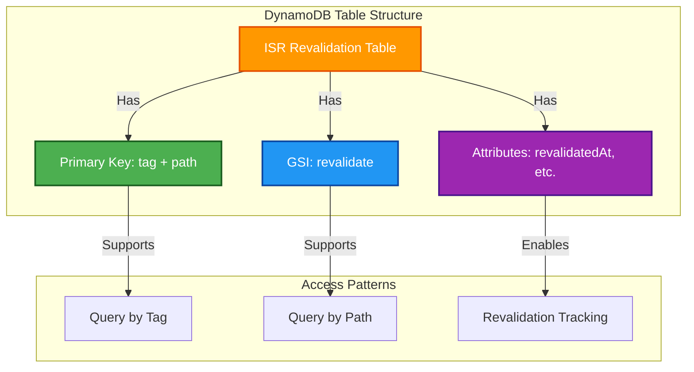

# 🗄️ OpenNext DynamoDB Module

This module creates a DynamoDB table for OpenNext ISR (Incremental Static Regeneration) revalidation tracking.

## 📖 Overview

This module creates a DynamoDB table specifically designed for OpenNext's Incremental Static Regeneration (ISR) feature. The table tracks revalidation tags and paths, enabling efficient cache invalidation and content regeneration for Next.js applications.

The table is optimized for OpenNext's query patterns with a primary key structure and Global Secondary Index that support both tag-based and path-based lookups essential for ISR functionality.



## 🛠 Resources Used

| Resource             | Description                                                      | Documentation                                                                                                    |
| -------------------- | ---------------------------------------------------------------- | ---------------------------------------------------------------------------------------------------------------- |
| `aws_dynamodb_table` | Creates DynamoDB table with primary key and GSI for ISR tracking | [AWS DynamoDB Table](https://registry.terraform.io/providers/hashicorp/aws/latest/docs/resources/dynamodb_table) |

## ⚙️ Usage

### Basic ISR Table

```hcl
module "opennext_dynamodb" {
  source = "../../modules/opennext-dynamodb"

  table_name = "opennext-isr-revalidation"

  tags = {
    Environment = "production"
    Project     = "web-platform"
    Purpose     = "ISR"
  }
}
```

### ISR Table with Point-in-Time Recovery

```hcl
module "opennext_dynamodb" {
  source = "../../modules/opennext-dynamodb"

  table_name                     = "opennext-isr-revalidation"
  enable_point_in_time_recovery  = true
  billing_mode                   = "PAY_PER_REQUEST"

  tags = {
    Environment = "production"
    Project     = "web-platform"
    Purpose     = "ISR"
    Backup      = "enabled"
  }
}
```

---

## 🔑 Inputs

| Name                            | Description                                                     | Type          | Default             | Required |
| ------------------------------- | --------------------------------------------------------------- | ------------- | ------------------- | :------: |
| `table_name`                    | Name of the DynamoDB table                                      | `string`      | n/a                 |  ✅ Yes  |
| `billing_mode`                  | Billing mode for the table (PAY_PER_REQUEST or PROVISIONED)     | `string`      | `"PAY_PER_REQUEST"` |  ❌ No   |
| `enable_point_in_time_recovery` | Enable point-in-time recovery for data protection               | `bool`        | `true`              |  ❌ No   |
| `enable_deletion_protection`    | Enable deletion protection to prevent accidental table deletion | `bool`        | `false`             |  ❌ No   |
| `tags`                          | Tags to apply to the table                                      | `map(string)` | `{}`                |  ❌ No   |

---

## 📤 Outputs

| Name               | Description                                   |
| ------------------ | --------------------------------------------- |
| `table_name`       | Name of the DynamoDB table                    |
| `table_arn`        | ARN of the DynamoDB table                     |
| `table_id`         | ID of the DynamoDB table                      |
| `table_stream_arn` | ARN of the DynamoDB table stream (if enabled) |
| `gsi_name`         | Name of the Global Secondary Index            |

---

## 🌍 Notes

- **Schema Design:** The table uses a composite primary key with `tag` (partition key) and `path` (sort key) for efficient ISR tracking
- **Global Secondary Index:** The `revalidate` GSI enables path-based queries with `path` as partition key and `revalidatedAt` as sort key
- **Billing Mode:** Pay-per-request billing is used by default for cost efficiency with unpredictable traffic patterns
- **Backup Strategy:** Point-in-time recovery is enabled by default to protect against data loss
- **Performance:** The table is optimized for OpenNext's specific query patterns and supports high-frequency revalidation operations
- **Encryption:** Server-side encryption is automatically enabled using AWS managed keys
