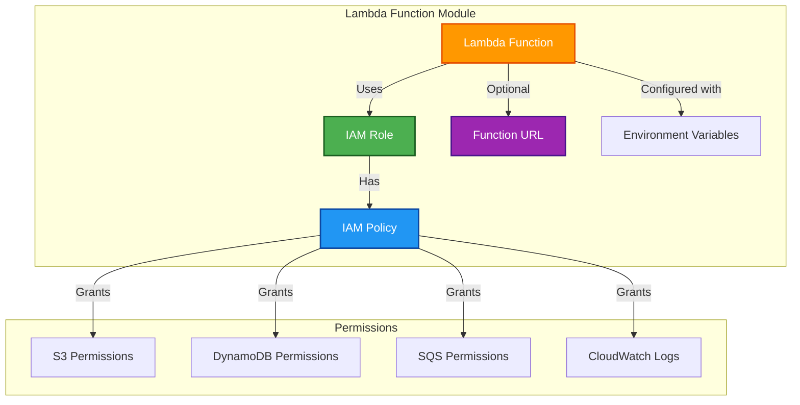

# ⚡ OpenNext Lambda Module

This module creates AWS Lambda functions for OpenNext deployment with proper IAM roles and permissions.

## 📖 Overview

This module is designed to create Lambda functions for the OpenNext architecture. It provides a flexible and reusable way to deploy different types of Lambda functions needed for a complete OpenNext setup, each with properly configured IAM roles and permissions.

The module supports various Lambda function types including server-side rendering, image optimization, revalidation, and warming functions, all optimized for Next.js applications.



## 🛠 Resources Used

| Resource                   | Description                                              | Documentation                                                                                                                |
| -------------------------- | -------------------------------------------------------- | ---------------------------------------------------------------------------------------------------------------------------- |
| `aws_lambda_function`      | Creates the Lambda function with specified configuration | [AWS Lambda Function](https://registry.terraform.io/providers/hashicorp/aws/latest/docs/resources/lambda_function)           |
| `aws_iam_role`             | Creates IAM role for the Lambda function                 | [AWS IAM Role](https://registry.terraform.io/providers/hashicorp/aws/latest/docs/resources/iam_role)                         |
| `aws_iam_role_policy`      | Creates IAM policies with necessary permissions          | [AWS IAM Role Policy](https://registry.terraform.io/providers/hashicorp/aws/latest/docs/resources/iam_role_policy)           |
| `aws_lambda_function_url`  | Creates function URL for direct HTTP access              | [AWS Lambda Function URL](https://registry.terraform.io/providers/hashicorp/aws/latest/docs/resources/lambda_function_url)   |
| `aws_cloudwatch_log_group` | Creates CloudWatch log group for function logs           | [AWS CloudWatch Log Group](https://registry.terraform.io/providers/hashicorp/aws/latest/docs/resources/cloudwatch_log_group) |

## ⚙️ Usage

### Server Lambda Function

```hcl
module "server_lambda" {
  source = "../../modules/opennext-lambda"

  function_name         = "opennext-server"
  handler              = "index.handler"
  runtime              = "nodejs18.x"
  memory_size          = 1024
  timeout              = 30
  create_function_url  = true

  # Permissions
  s3_permissions       = true
  dynamodb_permissions = true
  sqs_permissions      = true

  environment_variables = {
    CACHE_BUCKET_NAME = "my-app-cache"
    ISR_TABLE_NAME    = "my-app-isr"
    QUEUE_URL         = "https://sqs.region.amazonaws.com/account/queue"
  }

  tags = {
    Function    = "server"
    Environment = "production"
  }
}
```

### Image Optimization Lambda

```hcl
module "image_lambda" {
  source = "../../modules/opennext-lambda"

  function_name        = "opennext-image"
  handler             = "index.handler"
  runtime             = "nodejs18.x"
  memory_size         = 1536
  timeout             = 30
  create_function_url = true

  # Only S3 permissions needed for image optimization
  s3_permissions = true

  environment_variables = {
    BUCKET_NAME = "my-app-assets"
  }

  tags = {
    Function    = "image"
    Environment = "production"
  }
}
```

## 🔑 Inputs

| Name                    | Description                                | Type           | Default           | Required |
| ----------------------- | ------------------------------------------ | -------------- | ----------------- | :------: |
| `function_name`         | Name of the Lambda function                | `string`       | n/a               |  ✅ Yes  |
| `handler`               | Lambda function handler                    | `string`       | `"index.handler"` |  ❌ No   |
| `runtime`               | Lambda runtime                             | `string`       | `"nodejs18.x"`    |  ❌ No   |
| `architecture`          | Lambda architecture (x86_64 or arm64)      | `string`       | `"arm64"`         |  ❌ No   |
| `memory_size`           | Memory size in MB                          | `number`       | `512`             |  ❌ No   |
| `timeout`               | Timeout in seconds                         | `number`       | `30`              |  ❌ No   |
| `environment_variables` | Environment variables for the function     | `map(string)`  | `{}`              |  ❌ No   |
| `create_function_url`   | Create Lambda function URL for HTTP access | `bool`         | `true`            |  ❌ No   |
| `s3_permissions`        | Grant S3 read/write permissions            | `bool`         | `false`           |  ❌ No   |
| `dynamodb_permissions`  | Grant DynamoDB read/write permissions      | `bool`         | `false`           |  ❌ No   |
| `sqs_permissions`       | Grant SQS send/receive permissions         | `bool`         | `false`           |  ❌ No   |
| `lambda_permissions`    | Grant Lambda invoke permissions            | `bool`         | `false`           |  ❌ No   |
| `lambda_package_path`   | Path to Lambda deployment package          | `string`       | `null`            |  ❌ No   |
| `s3_bucket_arns`        | List of S3 bucket ARNs to grant access to  | `list(string)` | `[]`              |  ❌ No   |
| `dynamodb_table_arns`   | List of DynamoDB table ARNs                | `list(string)` | `[]`              |  ❌ No   |
| `sqs_queue_arns`        | List of SQS queue ARNs                     | `list(string)` | `[]`              |  ❌ No   |
| `lambda_function_arns`  | List of Lambda function ARNs to invoke     | `list(string)` | `[]`              |  ❌ No   |
| `log_retention_days`    | CloudWatch log retention period in days    | `number`       | `14`              |  ❌ No   |
| `enable_tracing`        | Enable AWS X-Ray tracing                   | `bool`         | `false`           |  ❌ No   |
| `tags`                  | Tags to apply to all resources             | `map(string)`  | `{}`              |  ❌ No   |

---

## 📤 Outputs

| Name                  | Description                      |
| --------------------- | -------------------------------- |
| `function_name`       | Name of the Lambda function      |
| `function_arn`        | ARN of the Lambda function       |
| `function_url`        | Function URL (if enabled)        |
| `function_url_domain` | Domain of the function URL       |
| `role_arn`            | ARN of the IAM role              |
| `role_name`           | Name of the IAM role             |
| `log_group_name`      | Name of the CloudWatch log group |
| `log_group_arn`       | ARN of the CloudWatch log group  |

---

## 🌍 Notes

- **Architecture:** ARM64 architecture is used by default for better price-performance ratio
- **Permissions:** The module supports granular permissions for S3, DynamoDB, and SQS based on function requirements
- **Function URLs:** Automatically creates function URLs for direct HTTP access when enabled
- **Logging:** CloudWatch log groups are automatically created with configurable retention periods
- **Security:** IAM roles follow least-privilege principles with only necessary permissions granted
- **Deployment:** Supports both packaged deployments and placeholder functions for CI/CD pipelines
