# 🚀 OpenNext Infrastructure Module

This is the main OpenNext module that creates all necessary AWS infrastructure for deploying a Next.js application using OpenNext.

## 📖 Overview

This module creates a complete OpenNext deployment infrastructure following the recommended serverless architecture for Next.js applications. It provides a production-ready setup with all the necessary components for server-side rendering, static asset delivery, image optimization, and incremental static regeneration.

The module orchestrates multiple AWS services to create a highly scalable and cost-effective Next.js deployment that automatically handles traffic spikes and provides global content delivery.

### 🔄 Deployment Model

This infrastructure is designed with a clear separation of concerns:

1. **Infrastructure Provisioning (Terraform)**: This module creates all necessary AWS resources with placeholder/empty Lambda functions
2. **Application Deployment (CI/CD)**: The GitHub Actions workflow handles building and deploying the Next.js application code
3. **State Management**: Lambda functions use the `ignore_changes` lifecycle policy to prevent Terraform from reverting CI/CD updates

```mermaid
flowchart TD
  %% Subgraphs define logical grouping and node ownership
  subgraph CDN_Layer["🌐 CDN Layer"]
    direction LR
    CF[☁️ CloudFront<br>Distribution]
    S3A[📦 S3<br>Assets Bucket]
  end

  subgraph Compute_Layer["⚙️ Compute Layer"]
    direction TB
    SL[λ Server<br>Lambda]
    IL[🖼️ Image<br>Lambda]
    S3C[🗂️ S3<br>Cache Bucket]
    SQS[📬 SQS<br>FIFO Queue]
    RL[🔄 Revalidation<br>Lambda]
    DDB[💾 DynamoDB<br>ISR Table]
  end

  subgraph Warming_Monitoring["⏱️ Warming & Monitoring"]
    direction TB
    EB[🗓️ EventBridge<br>Rule]
    WL[🌡️ Warmer<br>Lambda]
    CW[📊 CloudWatch<br>Logs]
  end

  %% Connections between nodes
  %% CDN Layer flow
  CF -- "Static Assets" --> S3A
  CF -- "SSR/API Routes" --> SL
  CF -- "Image Optimization" --> IL

  %% Compute Layer flow
  SL -- "Read/Write Cache" --> S3C
  SL -- "Queue Revalidation" --> SQS
  SQS -- "Trigger" --> RL
  RL -- "Invalidate Cache" --> S3C
  RL -- "Update Cache" --> DDB

  %% Warming flow
  EB -- "5min Schedule" --> WL
  WL -- "Keep Warm" --> SL
  WL -- "Keep Warm" --> IL

  %% Logging connections (dashed lines)
  SL -.->|Logs| CW
  IL -.->|Logs| CW
  RL -.->|Logs| CW

  %% Styling
  %% Subgraph Styles
  style CDN_Layer fill:#E3F2FD,stroke:#2196F3,stroke-width:1px,color:#1A237E
  style Compute_Layer fill:#E8F5E9,stroke:#4CAF50,stroke-width:1px,color:#1B5E20
  style Warming_Monitoring fill:#FFFDE7,stroke:#FFC107,stroke-width:1px,color:#FF6F00

  %% Node Styles - CDN Layer (Blues/Teals)
  style CF fill:#2196F3,stroke:#0D47A1,color:white,stroke-width:2px
  style S3A fill:#009688,stroke:#004D40,color:white,stroke-width:2px

  %% Node Styles - Compute Layer (Greens, Purples, Oranges, Pinks)
  style SL fill:#4CAF50,stroke:#1B5E20,color:white,stroke-width:2px
  style IL fill:#673AB7,stroke:#311B92,color:white,stroke-width:2px
  style RL fill:#9C27B0,stroke:#4A148C,color:white,stroke-width:2px
  style S3C fill:#00BCD4,stroke:#006064,color:white,stroke-width:2px
  style SQS fill:#FF9800,stroke:#E65100,color:white,stroke-width:2px
  style DDB fill:#E91E63,stroke:#880E4F,color:white,stroke-width:2px

  %% Node Styles - Warming & Monitoring Layer (Yellows, Greys)
  style EB fill:#FFEB3B,stroke:#F57F17,color:black,stroke-width:2px
  style WL fill:#FFC107,stroke:#FF8F00,color:black,stroke-width:2px
  style CW fill:#78909C,stroke:#37474F,color:white,stroke-width:2px
```



## 🛠 Resources Used

| Resource                      | Description                                                           | Documentation                                                                                                                      |
| ----------------------------- | --------------------------------------------------------------------- | ---------------------------------------------------------------------------------------------------------------------------------- |
| `aws_s3_bucket`               | Creates S3 buckets for assets and cache storage                       | [AWS S3 Bucket](https://registry.terraform.io/providers/hashicorp/aws/latest/docs/resources/s3_bucket)                             |
| `aws_lambda_function`         | Creates Lambda functions for server, image, revalidation, and warming | [AWS Lambda Function](https://registry.terraform.io/providers/hashicorp/aws/latest/docs/resources/lambda_function)                 |
| `aws_cloudfront_distribution` | Creates CloudFront distribution for global content delivery           | [AWS CloudFront Distribution](https://registry.terraform.io/providers/hashicorp/aws/latest/docs/resources/cloudfront_distribution) |
| `aws_dynamodb_table`          | Creates DynamoDB table for ISR revalidation tracking                  | [AWS DynamoDB Table](https://registry.terraform.io/providers/hashicorp/aws/latest/docs/resources/dynamodb_table)                   |
| `aws_sqs_queue`               | Creates SQS FIFO queue for revalidation messaging                     | [AWS SQS Queue](https://registry.terraform.io/providers/hashicorp/aws/latest/docs/resources/sqs_queue)                             |
| `aws_cloudwatch_event_rule`   | Creates EventBridge rules for Lambda warming                          | [AWS CloudWatch Event Rule](https://registry.terraform.io/providers/hashicorp/aws/latest/docs/resources/cloudwatch_event_rule)     |
| `aws_cloudwatch_log_group`    | Creates CloudWatch log groups for Lambda functions                    | [AWS CloudWatch Log Group](https://registry.terraform.io/providers/hashicorp/aws/latest/docs/resources/cloudwatch_log_group)       |

## ⚙️ Usage

### Basic OpenNext Deployment

```hcl
module "opennext" {
  source = "../../modules/opennext"

  project_name = "my-nextjs-app"
  environment  = "production"
  region       = "us-east-1"

  tags = {
    Environment = "production"
    Project     = "web-platform"
    Owner       = "frontend-team"
  }
}
```

### OpenNext with Custom Domain

```hcl
module "opennext" {
  source = "../../modules/opennext"

  project_name = "my-nextjs-app"
  environment  = "production"
  region       = "us-east-1"

  # Custom domain configuration
  domain_name     = "example.com"
  subdomain       = "app"
  certificate_arn = "arn:aws:acm:us-east-1:123456789012:certificate/abc123"
  hosted_zone_id  = "Z123456789"

  # Performance optimization
  enable_lambda_warming = true
  server_memory_size    = 1024
  image_memory_size     = 1536

  tags = {
    Environment = "production"
    Project     = "web-platform"
    Owner       = "frontend-team"
  }
}
```

### OpenNext with Enhanced Monitoring

```hcl
module "opennext" {
  source = "../../modules/opennext"

  project_name = "my-nextjs-app"
  environment  = "production"
  region       = "us-east-1"

  # Monitoring configuration
  enable_cloudwatch_logs = true
  log_retention_days     = 30
  enable_xray_tracing    = true

  # Resource configuration
  server_memory_size     = 2048
  server_timeout         = 30
  image_memory_size      = 1536
  image_timeout          = 30

  tags = {
    Environment = "production"
    Project     = "web-platform"
    Owner       = "frontend-team"
  }
}
```

---

## 🔑 Inputs

| Name                     | Description                                    | Type          | Default            | Required |
| ------------------------ | ---------------------------------------------- | ------------- | ------------------ | :------: |
| `project_name`           | Name of the project (used for resource naming) | `string`      | n/a                |  ✅ Yes  |
| `environment`            | Environment name (dev, staging, prod)          | `string`      | n/a                |  ✅ Yes  |
| `region`                 | AWS region for deployment                      | `string`      | n/a                |  ✅ Yes  |
| `domain_name`            | Custom domain name (optional)                  | `string`      | `null`             |  ❌ No   |
| `subdomain`              | Subdomain for the application                  | `string`      | `null`             |  ❌ No   |
| `certificate_arn`        | ARN of ACM certificate for custom domain       | `string`      | `null`             |  ❌ No   |
| `hosted_zone_id`         | Route53 hosted zone ID for custom domain       | `string`      | `null`             |  ❌ No   |
| `enable_lambda_warming`  | Enable Lambda warming to reduce cold starts    | `bool`        | `true`             |  ❌ No   |
| `price_class`            | CloudFront price class                         | `string`      | `"PriceClass_100"` |  ❌ No   |
| `server_memory_size`     | Memory size for server Lambda function (MB)    | `number`      | `1024`             |  ❌ No   |
| `image_memory_size`      | Memory size for image optimization Lambda (MB) | `number`      | `1536`             |  ❌ No   |
| `revalidate_memory_size` | Memory size for revalidation Lambda (MB)       | `number`      | `512`              |  ❌ No   |
| `warmer_memory_size`     | Memory size for warmer Lambda (MB)             | `number`      | `512`              |  ❌ No   |
| `enable_cloudwatch_logs` | Enable CloudWatch logging                      | `bool`        | `true`             |  ❌ No   |
| `log_retention_days`     | CloudWatch log retention period in days        | `number`      | `14`               |  ❌ No   |
| `tags`                   | Tags to apply to all resources                 | `map(string)` | `{}`               |  ❌ No   |

---

## 📤 Outputs

| Name                                  | Description                                    |
| ------------------------------------- | ---------------------------------------------- |
| `cloudfront_distribution_id`          | ID of the CloudFront distribution              |
| `cloudfront_distribution_domain_name` | Domain name of the CloudFront distribution     |
| `cloudfront_distribution_arn`         | ARN of the CloudFront distribution             |
| `cloudfront_hosted_zone_id`           | Hosted zone ID of the CloudFront distribution  |
| `assets_bucket_name`                  | Name of the S3 assets bucket                   |
| `assets_bucket_arn`                   | ARN of the S3 assets bucket                    |
| `cache_bucket_name`                   | Name of the S3 cache bucket                    |
| `cache_bucket_arn`                    | ARN of the S3 cache bucket                     |
| `server_function_name`                | Name of the server Lambda function             |
| `server_function_arn`                 | ARN of the server Lambda function              |
| `server_function_url`                 | URL of the server Lambda function              |
| `image_function_name`                 | Name of the image optimization Lambda function |
| `image_function_arn`                  | ARN of the image optimization Lambda function  |
| `image_function_url`                  | URL of the image optimization Lambda function  |
| `revalidation_function_name`          | Name of the revalidation Lambda function       |
| `revalidation_function_arn`           | ARN of the revalidation Lambda function        |
| `warmer_function_name`                | Name of the warmer Lambda function             |
| `warmer_function_arn`                 | ARN of the warmer Lambda function              |
| `dynamodb_table_name`                 | Name of the DynamoDB revalidation table        |
| `dynamodb_table_arn`                  | ARN of the DynamoDB revalidation table         |
| `sqs_queue_url`                       | URL of the SQS revalidation queue              |
| `sqs_queue_arn`                       | ARN of the SQS revalidation queue              |
| `application_url`                     | Primary URL for accessing the application      |
| `custom_domain`                       | Custom domain name (if configured)             |
| `deployment_region`                   | AWS region where resources are deployed        |

---

## 🌍 Notes

- **Architecture:** This module follows the OpenNext recommended serverless architecture for optimal performance and cost
- **Warming:** Lambda warming is enabled by default to reduce cold start latency for better user experience
- **Caching:** The module implements a multi-tier caching strategy using S3, DynamoDB, and CloudFront
- **ISR Support:** Full support for Next.js Incremental Static Regeneration with proper revalidation handling
- **Custom Domains:** Support for custom domains with automatic SSL certificate integration
- **Monitoring:** CloudWatch logging is enabled for all Lambda functions with configurable retention periods
- **Security:** All resources follow AWS security best practices with least-privilege IAM policies
