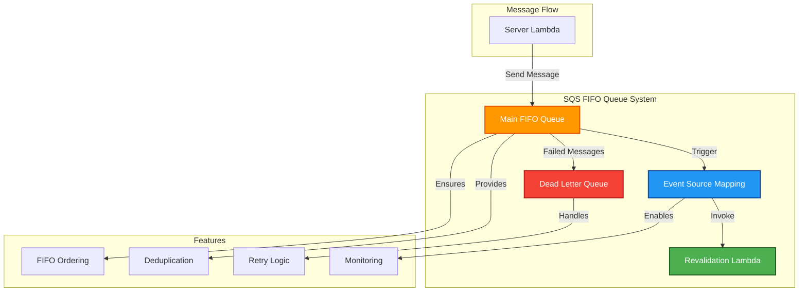

# 📬 OpenNext SQS Module

This module creates SQS FIFO queue for OpenNext ISR revalidation messages.

## 📖 Overview

This module creates a FIFO SQS queue specifically designed for OpenNext's Incremental Static Regeneration (ISR) revalidation system. The queue ensures ordered and deduplicated message processing, connecting the server Lambda function to the revalidation Lambda function for efficient cache invalidation.

The FIFO queue guarantees that revalidation messages are processed in the correct order and prevents duplicate revalidation requests for the same content, optimizing performance and reducing unnecessary processing.



## 🛠 Resources Used

| Resource                          | Description                                      | Documentation                                                                                                                              |
| --------------------------------- | ------------------------------------------------ | ------------------------------------------------------------------------------------------------------------------------------------------ |
| `aws_sqs_queue`                   | Creates FIFO SQS queue for revalidation messages | [AWS SQS Queue](https://registry.terraform.io/providers/hashicorp/aws/latest/docs/resources/sqs_queue)                                     |
| `aws_sqs_queue`                   | Creates dead letter queue for failed messages    | [AWS SQS Queue](https://registry.terraform.io/providers/hashicorp/aws/latest/docs/resources/sqs_queue)                                     |
| `aws_lambda_event_source_mapping` | Connects SQS queue to Lambda function            | [AWS Lambda Event Source Mapping](https://registry.terraform.io/providers/hashicorp/aws/latest/docs/resources/lambda_event_source_mapping) |

## ⚙️ Usage

### Basic ISR Revalidation Queue

```hcl
module "opennext_sqs" {
  source = "../../modules/opennext-sqs"

  queue_name                = "opennext-revalidation"
  revalidation_function_arn = module.revalidation_lambda.function_arn

  tags = {
    Environment = "production"
    Project     = "web-platform"
    Purpose     = "ISR"
  }
}
```

### Queue with Custom Configuration

```hcl
module "opennext_sqs" {
  source = "../../modules/opennext-sqs"

  queue_name                 = "opennext-revalidation"
  revalidation_function_arn  = module.revalidation_lambda.function_arn

  # Custom timeouts and retention
  visibility_timeout_seconds = 60
  message_retention_seconds  = 604800  # 7 days

  # Dead letter queue configuration
  create_dlq         = true
  max_receive_count  = 5

  tags = {
    Environment = "production"
    Project     = "web-platform"
    Purpose     = "ISR"
    Monitoring  = "enabled"
  }
}
```

## 🔑 Inputs

| Name                                 | Description                                              | Type          | Default   | Required |
| ------------------------------------ | -------------------------------------------------------- | ------------- | --------- | :------: |
| `queue_name`                         | Name of the SQS queue (without .fifo suffix)             | `string`      | n/a       |  ✅ Yes  |
| `revalidation_function_arn`          | ARN of the revalidation Lambda function                  | `string`      | n/a       |  ✅ Yes  |
| `visibility_timeout_seconds`         | Visibility timeout in seconds                            | `number`      | `30`      |  ❌ No   |
| `message_retention_seconds`          | Message retention period in seconds (1-14 days)          | `number`      | `1209600` |  ❌ No   |
| `receive_wait_time_seconds`          | Long polling wait time in seconds                        | `number`      | `20`      |  ❌ No   |
| `create_dlq`                         | Create a dead letter queue for failed messages           | `bool`        | `true`    |  ❌ No   |
| `max_receive_count`                  | Maximum receive count before moving to DLQ               | `number`      | `3`       |  ❌ No   |
| `dlq_message_retention_seconds`      | DLQ message retention period in seconds                  | `number`      | `1209600` |  ❌ No   |
| `batch_size`                         | Maximum number of messages to retrieve in a single batch | `number`      | `10`      |  ❌ No   |
| `maximum_batching_window_in_seconds` | Maximum time to wait for a full batch                    | `number`      | `5`       |  ❌ No   |
| `tags`                               | Tags to apply to resources                               | `map(string)` | `{}`      |  ❌ No   |

---

## 📤 Outputs

| Name                        | Description                                |
| --------------------------- | ------------------------------------------ |
| `queue_url`                 | URL of the SQS FIFO queue                  |
| `queue_arn`                 | ARN of the SQS FIFO queue                  |
| `queue_name`                | Name of the SQS FIFO queue                 |
| `dlq_url`                   | URL of the dead letter queue (if created)  |
| `dlq_arn`                   | ARN of the dead letter queue (if created)  |
| `dlq_name`                  | Name of the dead letter queue (if created) |
| `event_source_mapping_uuid` | UUID of the Lambda event source mapping    |

---

## 🌍 Notes

- **FIFO Guarantees:** The queue ensures exactly-once processing and maintains message order for revalidation requests
- **Deduplication:** Content-based deduplication prevents duplicate revalidation messages within a 5-minute window
- **Dead Letter Queue:** Failed messages are automatically moved to a DLQ after the maximum receive count is exceeded
- **Event Source Mapping:** The queue is automatically connected to the revalidation Lambda function with optimal batch settings
- **Performance:** Long polling is enabled by default to reduce empty responses and improve efficiency
- **Monitoring:** CloudWatch metrics are automatically available for queue depth, message age, and processing rates
- **Security:** The queue is configured with appropriate IAM permissions for the connected Lambda function
