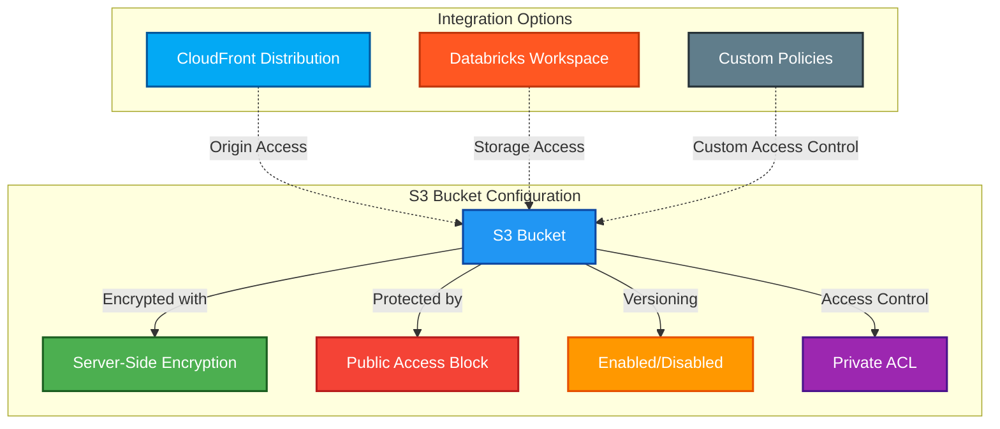

# ☁️ S3 Module

A Terraform module that creates a secure Amazon S3 bucket with all the necessary protections and controls. Designed for flexibility across various AWS storage use cases.

## 📖 Overview

This module sets up a production-ready S3 bucket with encryption, versioning, and proper access controls. The bucket is designed to serve multiple purposes:

- CloudFront-backed static website hosting
- Data lake and analytics storage
- Databricks workspace root storage
- Secure artifact and deployment packages
- Terraform/OpenTofu state backend
- General purpose storage with proper security



## 🛠 Resources Used

| Resource                                             | Description                                                     | Documentation                                                                                                                                   |
| ---------------------------------------------------- | --------------------------------------------------------------- | ----------------------------------------------------------------------------------------------------------------------------------------------- |
| `aws_s3_bucket`                                      | Creates an S3 bucket for storage                                | [AWS S3 Bucket](https://registry.terraform.io/providers/hashicorp/aws/latest/docs/resources/s3_bucket)                                          |
| `aws_s3_bucket_versioning`                           | Enables versioning to track changes in stored data              | [AWS S3 Bucket Versioning](https://registry.terraform.io/providers/hashicorp/aws/latest/docs/resources/s3_bucket_versioning)                    |
| `aws_s3_bucket_server_side_encryption_configuration` | Enforces server-side encryption (AES-256)                       | [AWS S3 Encryption](https://registry.terraform.io/providers/hashicorp/aws/latest/docs/resources/s3_bucket_server_side_encryption_configuration) |
| `aws_s3_bucket_public_access_block`                  | Blocks public access to the S3 bucket                           | [AWS S3 Public Access Block](https://registry.terraform.io/providers/hashicorp/aws/latest/docs/resources/s3_bucket_public_access_block)         |
| `aws_s3_bucket_ownership_controls`                   | Sets bucket ownership controls                                  | [AWS S3 Ownership Controls](https://registry.terraform.io/providers/hashicorp/aws/latest/docs/resources/s3_bucket_ownership_controls)           |
| `aws_s3_bucket_acl`                                  | Sets access control lists for the bucket                        | [AWS S3 ACL](https://registry.terraform.io/providers/hashicorp/aws/latest/docs/resources/s3_bucket_acl)                                         |
| `aws_s3_bucket_policy`                               | Optional: Configures policy for CloudFront or Databricks access | [AWS S3 Bucket Policy](https://registry.terraform.io/providers/hashicorp/aws/latest/docs/resources/s3_bucket_policy)                            |

## ⚙️ Usage

Here are some practical examples of how to use this module:

### Basic Secure Storage

```hcl
module "secure_s3" {
  source      = "../../modules/s3"
  bucket_name = "project-assets-prod-eu-central-1"

  tags = {
    Environment = "production"
    Project     = "data-platform"
    Owner       = "platform-team"
  }
}
```

### CloudFront Content Delivery

```hcl
module "cdn_storage" {
  source                      = "../../modules/s3"
  bucket_name                 = "website-static-assets-prod"
  cloudfront_distribution_arn = module.cloudfront.cloudfront_distribution_arn

  # Static content doesn't usually need versioning
  enable_versioning           = false

  tags = {
    Environment = "production"
    Service     = "marketing-website"
    Team        = "web-frontend"
  }
}
```

### Databricks Workspace Storage

```hcl
# First generate the Databricks-specific policy
module "databricks_workspace_s3_policy" {
  source      = "../../modules/databricks/workspace-s3-policy"
  bucket_name = "databricks-workspace-root-12345"
}

# Then create the bucket with the generated policy
module "databricks_workspace_s3" {
  source             = "../../modules/s3"
  bucket_name        = "databricks-workspace-root-12345"
  enable_versioning  = false
  custom_policy_json = module.databricks_workspace_s3_policy.policy_json

  tags = {
    Environment = "development"
    Service     = "databricks"
    Purpose     = "workspace-storage"
    Team        = "data-science"
  }
}
```

### Terraform State Storage

```hcl
module "terraform_state_s3" {
  source      = "../../modules/s3"
  bucket_name = "terraform-state-prod-eu-central-1"

  tags = {
    Environment = "production"
    Purpose     = "terraform-state"
    Critical    = "true"
  }
}

# Don't forget the DynamoDB table for state locking
module "terraform_state_lock" {
  source     = "../../modules/dynamodb"
  table_name = "terraform-state-lock"
}
```

## 🔒 Security Considerations

We've built in security by default:

- **Encryption**: All objects are automatically encrypted with AES-256
- **No Public Access**: All public access is blocked at the bucket level
- **Ownership Controls**: Bucket owner automatically gets full control of all objects
- **Private by Default**: Standard private ACL applied to the bucket
- **Delete Protection**: Lifecycle configuration prevents accidental bucket deletion

For even higher security requirements:

- Use KMS instead of AES-256 for regulated/sensitive data
- Set up cross-region replication for disaster recovery
- Enable Object Lock for immutable storage (WORM)
- Turn on S3 Access Logs to track all bucket operations

## 🔑 Inputs

| Name                          | Description                                                | Type          | Default | Required |
| ----------------------------- | ---------------------------------------------------------- | ------------- | ------- | :------: |
| `bucket_name`                 | The name of the S3 bucket to create                        | `string`      | n/a     |  ✅ Yes  |
| `enable_versioning`           | Enable versioning on the S3 bucket                         | `bool`        | `true`  |  ❌ No   |
| `tags`                        | Tags to apply to all resources                             | `map(string)` | `{}`    |  ❌ No   |
| `cloudfront_distribution_arn` | Optional: ARN of CloudFront distribution for bucket access | `string`      | `null`  |  ❌ No   |
| `custom_policy_json`          | Optional: A custom bucket policy JSON document             | `string`      | `null`  |  ❌ No   |

## 📤 Outputs

| Name                 | Description                      |
| -------------------- | -------------------------------- |
| `bucket_id`          | The ID of the S3 bucket          |
| `bucket_arn`         | ARN of the created S3 bucket     |
| `bucket_domain_name` | The domain name of the S3 bucket |
