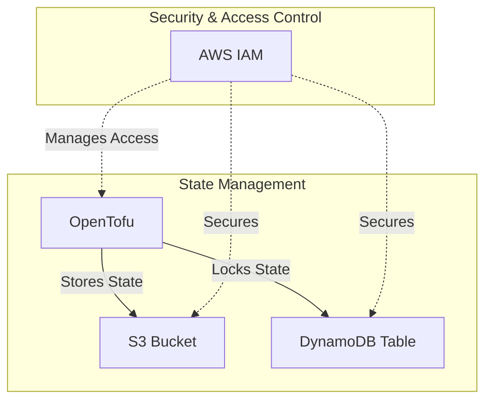

# ☁️ S3 Module

This module provisions an **Amazon S3 bucket** with **DynamoDB-based state locking** to store and manage OpenTofu (Terraform) state files securely.

## 📖 Overview

OpenTofu uses a **backend** to manage its state file. This module provisions an S3 bucket to store the state file and a DynamoDB table to provide state locking and prevent race conditions when multiple users run OpenTofu operations.



## 🛠 Resources Used

| Resource                   | Description                                               | Documentation                                                                                                           |
| -------------------------- | --------------------------------------------------------- | ----------------------------------------------------------------------------------------------------------------------- |
| `aws_s3_bucket`            | Creates an S3 bucket for Terraform state storage           | [AWS S3 Bucket](https://registry.terraform.io/providers/hashicorp/aws/latest/docs/resources/s3_bucket)                  |
| `aws_s3_bucket_versioning` | Enables versioning to track changes in the Terraform state | [AWS S3 Bucket Versioning](https://registry.terraform.io/providers/hashicorp/aws/latest/docs/resources/s3_bucket_versioning) |
| `aws_dynamodb_table`       | Provides state locking for Terraform to prevent conflicts  | [AWS DynamoDB](https://registry.terraform.io/providers/hashicorp/aws/latest/docs/resources/dynamodb_table)              |


## ⚙️ Usage

To use this module in your OpenTofu configuration:

```hcl
terraform {
  backend "s3" {
    bucket         = "your-terraform-state"
    key            = "terraform.tfstate"
    region         = "eu-central-1"
    dynamodb_table = "your-terraform-state-lock"
    encrypt        = true
  }
}

module "your_terraform_state_s3" {
  source = "../../modules/s3"
}
```

## 🔑 Inputs

| Name                | Description                                  | Type     | Default                     | Required |
| ------------------- | -------------------------------------------- | -------- | --------------------------- | -------- |
| bucket_name         | The name of the S3 bucket for state storage  | `string` | `"open-jii-terraform-state"` | ✅ Yes   |
| dynamodb_table_name | Name of the DynamoDB table for state locking | `string` | `"terraform-state-lock"`     | ✅ Yes   |

## 📤 Outputs

| Name               | Description                       |
| ------------------ | --------------------------------- |
| bucket_arn         | ARN of the created S3 bucket      |
| dynamodb_table_arn | ARN of the created DynamoDB table |
