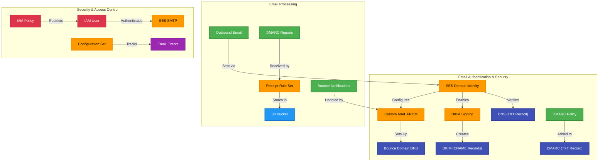
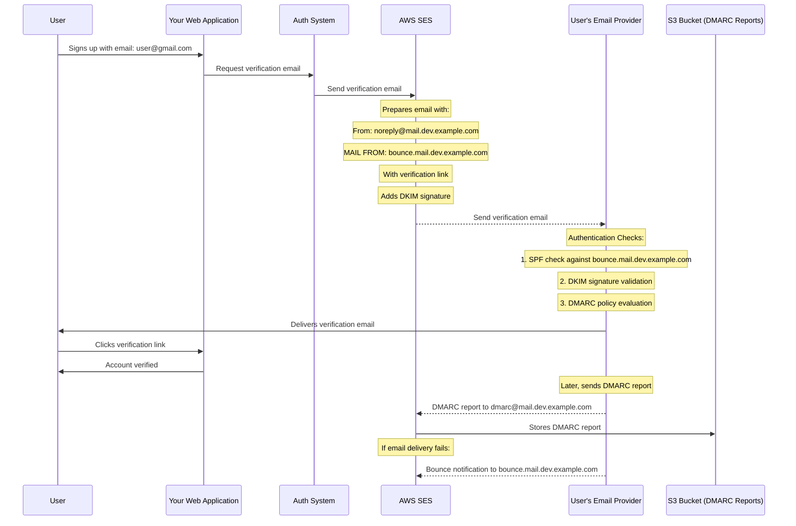

# 📧 Amazon SES Module

A Terraform module that sets up a complete AWS Simple Email Service (SES) configuration for transactional email sending with comprehensive authentication and security measures.

## 📖 Overview

This module provisions a complete email infrastructure using Amazon SES, including domain verification, DKIM signing, custom MAIL FROM domain, proper SPF/DMARC configuration, and optional DMARC report collection. It's designed to ensure high email deliverability and security for transactional emails.



## 🛠 Resources Used

| Resource                             | Description                                          | Documentation                                                                                                                  |
| ------------------------------------ | ---------------------------------------------------- | ------------------------------------------------------------------------------------------------------------------------------ |
| `aws_ses_domain_identity`            | Registers and verifies a domain with SES             | [AWS SES Domain Identity](https://registry.terraform.io/providers/hashicorp/aws/latest/docs/resources/ses_domain_identity)     |
| `aws_ses_domain_dkim`                | Generates DKIM tokens for email authentication       | [AWS SES DKIM](https://registry.terraform.io/providers/hashicorp/aws/latest/docs/resources/ses_domain_dkim)                    |
| `aws_ses_domain_mail_from`           | Sets up custom MAIL FROM domain for SPF alignment    | [AWS SES MAIL FROM](https://registry.terraform.io/providers/hashicorp/aws/latest/docs/resources/ses_domain_mail_from)          |
| `aws_route53_record`                 | Creates various DNS records for email authentication | [AWS Route53 Record](https://registry.terraform.io/providers/hashicorp/aws/latest/docs/resources/route53_record)               |
| `aws_s3_bucket`                      | Storage for DMARC reports                            | [AWS S3 Bucket](https://registry.terraform.io/providers/hashicorp/aws/latest/docs/resources/s3_bucket)                         |
| `aws_ses_receipt_rule_set`           | Rules for processing incoming emails                 | [AWS SES Receipt Rule Set](https://registry.terraform.io/providers/hashicorp/aws/latest/docs/resources/ses_receipt_rule_set)   |
| `aws_iam_user`, `aws_iam_access_key` | SMTP credentials for sending emails                  | [AWS IAM User](https://registry.terraform.io/providers/hashicorp/aws/latest/docs/resources/iam_user)                           |
| `aws_ses_configuration_set`          | Tracking and management of email sending             | [AWS SES Configuration Set](https://registry.terraform.io/providers/hashicorp/aws/latest/docs/resources/ses_configuration_set) |

## ⚙️ Usage

Here are some practical examples of how to use this module:

### Basic Transactional Email Setup

```hcl
module "ses" {
  source        = "../../modules/ses"
  domain_name   = "example.com"
  subdomain     = "mail"
  environment   = "dev"
  service_name  = "transactional-email"
  route53_zone_id = module.route53.zone_id

  allowed_from_addresses = [
    "noreply@mail.dev.example.com",
    "support@mail.dev.example.com"
  ]

  tags = {
    Environment = "development"
    Service     = "user-notifications"
  }
}
```

### Complete Setup with DMARC Reports

```hcl
module "ses" {
  source        = "../../modules/ses"
  domain_name   = "example.com"
  subdomain     = "mail"
  environment   = "prod"
  service_name  = "transactional-email"
  route53_zone_id = module.route53.zone_id

  allowed_from_addresses = [
    "noreply@mail.prod.example.com",
    "verification@mail.prod.example.com",
    "support@mail.prod.example.com"
  ]

  # DMARC configuration
  enable_dmarc_reports = true
  dmarc_report_retention_days = 365
  dmarc_policy = "v=DMARC1; p=reject; adkim=s; aspf=s; pct=100; rua=mailto:dmarc@mail.prod.example.com"

  # MX record for receiving emails
  mx_records = ["10 inbound-smtp.eu-central-1.amazonaws.com"]

  # Event tracking
  enable_event_publishing = true

  tags = {
    Environment = "production"
    Service     = "email-communications"
    Team        = "platform"
  }
}
```

### For Use with Auth.js/NextAuth

```hcl
# First set up SES
module "ses" {
  source        = "../../modules/ses"
  region        = "us-east-1"
  domain_name   = "example.com"
  subdomain     = "mail"
  environment   = "dev"
  service_name  = "transactional-email"
  route53_zone_id = module.route53.zone_id

  allowed_from_addresses = [
    "noreply@mail.dev.example.com"
  ]
}

# Then store SMTP credentials in Secrets Manager
module "ses_secrets" {
  source      = "../../modules/secrets-manager"
  secret_name = "openjii-ses-secrets-dev"

  secret_string = jsonencode({
    AUTH_EMAIL_SERVER = module.ses.auth_email_server
    AUTH_EMAIL_FROM   = "noreply@mail.dev.example.com"
  })
}
```

## 🔑 Inputs

| Name                        | Description                                           | Type           | Default                 | Required |
| --------------------------- | ----------------------------------------------------- | -------------- | ----------------------- | -------- |
| domain_name                 | Base domain name for SES (e.g., example.com)          | `string`       | n/a                     | ✅ Yes   |
| subdomain                   | Subdomain for SES emails (e.g., 'mail')               | `string`       | `""`                    | ❌ No    |
| environment                 | Environment name (e.g., dev, staging, prod)           | `string`       | n/a                     | ✅ Yes   |
| service_name                | Service name for SES configuration set                | `string`       | `"transactional-email"` | ❌ No    |
| route53_zone_id             | Route53 hosted zone ID for DNS records                | `string`       | n/a                     | ✅ Yes   |
| region                      | Region                                                | `string`.      | n/a                     | ✅ Yes   |
| create_smtp_user            | Whether to create an IAM user for SMTP authentication | `bool`         | `true`                  | ❌ No    |
| allowed_from_addresses      | List of email addresses allowed to send               | `list(string)` | `[]`                    | ❌ No    |
| dmarc_policy                | DMARC policy record                                   | `string`       | `""`                    | ❌ No    |
| mx_records                  | MX records for the domain (for receiving emails)      | `list(string)` | `null`                  | ❌ No    |
| enable_event_publishing     | Enable SES event publishing to CloudWatch             | `bool`         | `true`                  | ❌ No    |
| enable_dmarc_reports        | Enable DMARC report collection infrastructure         | `bool`         | `true`                  | ❌ No    |
| dmarc_report_retention_days | Number of days to retain DMARC reports                | `number`       | `365`                   | ❌ No    |
| tags                        | Map of tags to assign to resources                    | `map(string)`  | `{}`                    | ❌ No    |

## 📤 Outputs

| Name                   | Description                                       |
| ---------------------- | ------------------------------------------------- |
| domain_identity_arn    | ARN of the SES domain identity                    |
| smtp_username          | SMTP username for SMTP authentication             |
| smtp_password          | SMTP password for SMTP authentication (sensitive) |
| smtp_server            | SES SMTP server endpoint                          |
| auth_email_server      | Complete AUTH_EMAIL_SERVER string for Auth.js     |
| from_domain            | The configured from domain                        |
| configuration_set_name | Name of the SES configuration set                 |

### Refresher on SPF, DKIM, DMARC & mail propagation with example


