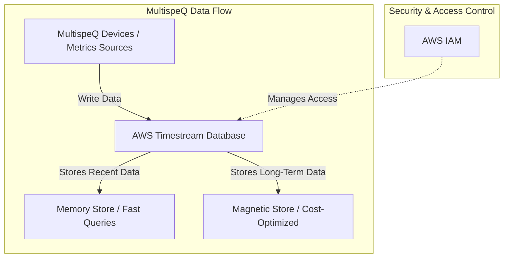

# ⏳ Timestream Module

This module provisions an **AWS Timestream database and table** for storing and querying **time-series data**. Timestream is designed for high-performance ingestion and long-term storage of time-dependent data, making it ideal for IoT, monitoring, and analytics workloads.

## 📖 Overview

AWS Timestream provides **serverless, scalable, and efficient time-series storage** with built-in memory and magnetic-tier retention. This module allows you to configure a database and table with **custom retention policies** to optimize costs and query performance.



## 🛠 Resources Used

| Resource                       | Description                         | Documentation                                                                                                                   |
| ------------------------------ | ----------------------------------- | ------------------------------------------------------------------------------------------------------------------------------- |
| `aws_timestreamwrite_database` | Creates a Timestream database       | [AWS Timestream Database](https://registry.terraform.io/providers/hashicorp/aws/latest/docs/resources/timestreamwrite_database) |
| `aws_timestreamwrite_table`    | Creates a table inside the database | [AWS Timestream Table](https://registry.terraform.io/providers/hashicorp/aws/latest/docs/resources/timestreamwrite_table)       |

## ⚙️ Usage

To deploy this Timestream module, use the following Terraform configuration:

```hcl
module "timestream" {
  source                   = "../../modules/timestream"
  database_name            = "sensor_data_db"
  table_name               = "device_metrics"
  memory_retention_hours   = 24
  magnetic_retention_days  = 7
}
```

## 🔑 Inputs

| Name                    | Description                                   | Type     | Default | Required |
| ----------------------- | --------------------------------------------- | -------- | ------- | -------- |
| database_name           | Name of the Timestream database               | `string` | n/a     | ✅ Yes   |
| table_name              | Name of the Timestream table                  | `string` | n/a     | ✅ Yes   |
| memory_retention_hours  | Retention period in hours for in-memory store | `number` | `6`     | ❌ No    |
| magnetic_retention_days | Retention period in days for magnetic store   | `number` | `2`     | ❌ No    |

## 📤 Outputs

| Name                    | Description                            |
| ----------------------- | -------------------------------------- |
| timestream_database_arn | ARN of the created Timestream database |
| timestream_table_arn    | ARN of the created Timestream table    |

## 🌍 Notes

- The memory store enables **fast queries on recent data**, while the magnetic store is optimized for **long-term historical analysis**.
- Timestream can be integrated with **IoT Core, CloudWatch, and other AWS services** to streamline analytics.
- Custom queries can be executed using **Timestream Query API** for real-time insights.
- Does not enable direct data processing on its own.
