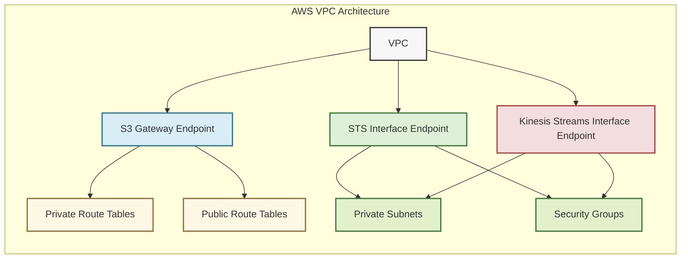

# 🏁 VPC Endpoints Module

This module provisions VPC endpoints for S3, STS, and Kinesis Streams in AWS. It leverages both Gateway and Interface endpoint types to enable secure, private connectivity between the VPC and AWS services.

## 📖 Overview

VPC endpoints streamline secure connectivity between a VPC and essential AWS services by provisioning dedicated endpoints. It sets up a Gateway endpoint for S3, linking it to both public and private route tables for efficient and private access. At the same time, it deploys Interface endpoints for STS and Kinesis Streams that are anchored in specific private subnets and protected by security groups.



## 🛠 Resources Used

| Resource / Data Source                                                                                                               | Description                                           | Documentation                                                                           |
| ------------------------------------------------------------------------------------------------------------------------------------ | ----------------------------------------------------- | --------------------------------------------------------------------------------------- |
| [**`aws_vpc_endpoint`** (S3)](https://registry.terraform.io/providers/hashicorp/aws/latest/docs/resources/vpc_endpoint)              | Creates a Gateway VPC Endpoint for S3                 | [AWS VPC Endpoint](https://docs.aws.amazon.com/vpc/latest/userguide/vpc-endpoints.html) |
| [**`aws_vpc_endpoint`** (STS)](https://registry.terraform.io/providers/hashicorp/aws/latest/docs/resources/vpc_endpoint)             | Creates an Interface VPC Endpoint for STS             | [AWS VPC Endpoint](https://docs.aws.amazon.com/vpc/latest/userguide/vpc-endpoints.html) |
| [**`aws_vpc_endpoint`** (Kinesis Streams)](https://registry.terraform.io/providers/hashicorp/aws/latest/docs/resources/vpc_endpoint) | Creates an Interface VPC Endpoint for Kinesis Streams | [AWS VPC Endpoint](https://docs.aws.amazon.com/vpc/latest/userguide/vpc-endpoints.html) |

## ⚙️ Usage

Include this module in your Terraform configuration as follows:

```hcl
module "vpc_endpoints" {
  source                 = "./modules/vpc-endpoints"
  vpc_id                 = "vpc-0abcd1234efgh5678"
  aws_region             = "eu-central-1"
  prefix                 = "myproject"
  tags                   = {
    Environment = "prod"
    Owner       = "network-team"
  }
  private_route_table_ids = ["rtb-0123456789abcdef0", "rtb-0fedcba9876543210"]
  public_route_table_ids  = ["rtb-0987654321abcdef0"]
  private_subnet_ids      = ["subnet-0123456789abcdef0", "subnet-0fedcba9876543210"]
  security_group_ids      = ["sg-0123abcd4567efgh8"]
}
```

## 🔑 Inputs

| Name                      | Description                                                        | Type         | Default        | Required |
| ------------------------- | ------------------------------------------------------------------ | ------------ | -------------- | :------: |
| `vpc_id`                  | The VPC ID in which to create the endpoints                        | string       | n/a            |  ✅ Yes  |
| `aws_region`              | AWS region for infrastructure deployment                           | string       | "eu-central-1" |  ❌ No   |
| `prefix`                  | Prefix for resource names                                          | string       | n/a            |  ✅ Yes  |
| `tags`                    | Common tags for the endpoints                                      | map(string)  | n/a            |  ✅ Yes  |
| `private_route_table_ids` | List of private route table IDs for the VPC (used for S3 endpoint) | list(string) | n/a            |  ✅ Yes  |
| `public_route_table_ids`  | List of public route table IDs for the VPC (used for S3 endpoint)  | list(string) | n/a            |  ✅ Yes  |
| `private_subnet_ids`      | List of private subnet IDs (used for interface endpoints)          | list(string) | n/a            |  ✅ Yes  |
| `security_group_ids`      | List of security group IDs to attach to interface endpoints        | list(string) | n/a            |  ✅ Yes  |

## 📤 Outputs

| Name                  | Description                            |
| --------------------- | -------------------------------------- |
| `s3_endpoint_id`      | ID of the S3 VPC endpoint              |
| `sts_endpoint_id`     | ID of the STS VPC endpoint             |
| `kinesis_endpoint_id` | ID of the Kinesis Streams VPC endpoint |
