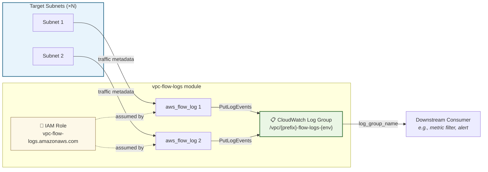

# 📊 VPC Flow Logs Module

This module provisions **subnet-level VPC flow logs** that capture network traffic metadata and ship it to CloudWatch Logs. It creates the log group, IAM plumbing, and one flow log resource per subnet.

## 📖 Overview

VPC Flow Logs record information about IP traffic going to and from network interfaces in your subnets. Each log entry captures source/destination IPs, ports, protocol, packet/byte counts, and — critically — whether the traffic was **accepted or rejected** by security groups and NACLs.

This module is designed to be **reusable** — attach it to any set of subnets (isolated, private, public) by passing different `name_prefix` and `subnet_ids`.



### What a flow log entry looks like

```
2 123456789012 eni-abc123 10.0.4.15 10.0.1.50 54321 443 6 5 1500 1708000000 1708000060 ACCEPT OK
2 123456789012 eni-abc123 10.0.4.15 8.8.8.8   54322 53  17 1 64   1708000000 1708000060 REJECT OK
```

| Field                       | Value  | Meaning                                          |
| --------------------------- | ------ | ------------------------------------------------ |
| `10.0.4.15 → 10.0.1.50:443` | ACCEPT | Lambda reaching CloudWatch VPC endpoint (normal) |
| `10.0.4.15 → 8.8.8.8:53`    | REJECT | Something tried DNS to public internet (blocked) |

## 🛠 Resources Created

| Resource                                                                                                                       | Description                                   | Docs                                                                                  |
| ------------------------------------------------------------------------------------------------------------------------------ | --------------------------------------------- | ------------------------------------------------------------------------------------- |
| [`aws_cloudwatch_log_group`](https://registry.terraform.io/providers/hashicorp/aws/latest/docs/resources/cloudwatch_log_group) | Log storage with configurable retention       | [CloudWatch Logs](https://docs.aws.amazon.com/AmazonCloudWatch/latest/logs/)          |
| [`aws_iam_role`](https://registry.terraform.io/providers/hashicorp/aws/latest/docs/resources/iam_role)                         | Role assumed by `vpc-flow-logs.amazonaws.com` | [Flow Log IAM](https://docs.aws.amazon.com/vpc/latest/userguide/flow-logs-cwl.html)   |
| [`aws_iam_role_policy`](https://registry.terraform.io/providers/hashicorp/aws/latest/docs/resources/iam_role_policy)           | Scoped write access to the log group          | [IAM Policies](https://docs.aws.amazon.com/IAM/latest/UserGuide/access_policies.html) |
| [`aws_flow_log`](https://registry.terraform.io/providers/hashicorp/aws/latest/docs/resources/flow_log)                         | One per subnet — captures traffic metadata    | [VPC Flow Logs](https://docs.aws.amazon.com/vpc/latest/userguide/flow-logs.html)      |

## ⚙️ Usage

```hcl
module "flow_logs" {
  source = "../vpc-flow-logs"

  name_prefix       = "macro-sandbox"
  environment       = var.environment
  subnet_ids        = var.isolated_subnet_ids
  retention_in_days = 14

  tags = { Component = "macro-sandbox" }
}

# Feed into a metric filter for alerting
resource "aws_cloudwatch_log_metric_filter" "rejected" {
  log_group_name = module.flow_logs.log_group_name
  pattern        = "REJECT"
  # ...
}
```

## 🔑 Inputs

| Name                       | Description                                      | Type           | Default | Required |
| -------------------------- | ------------------------------------------------ | -------------- | ------- | :------: |
| `name_prefix`              | Prefix for resource names (e.g., `macro-sandbox`) | `string`       | —       |  ✅ Yes  |
| `environment`              | Environment name (e.g., dev, staging, prod)      | `string`       | —       |  ✅ Yes  |
| `subnet_ids`               | Subnet IDs to attach flow logs to                | `list(string)` | —       |  ✅ Yes  |
| `retention_in_days`        | CloudWatch log retention (days)                  | `number`       | `14`    |  ❌ No   |
| `traffic_type`             | Traffic to capture: `ACCEPT`, `REJECT`, or `ALL` | `string`       | `"ALL"` |  ❌ No   |
| `max_aggregation_interval` | Aggregation window in seconds (`60` or `600`)    | `number`       | `60`    |  ❌ No   |
| `tags`                     | Additional tags for all resources                | `map(string)`  | `{}`    |  ❌ No   |

## 📤 Outputs

| Name             | Description                                                      |
| ---------------- | ---------------------------------------------------------------- |
| `log_group_name` | CloudWatch log group name — pass to metric filters or dashboards |
| `log_group_arn`  | CloudWatch log group ARN                                         |
| `iam_role_arn`   | IAM role ARN used by the flow logs                               |
