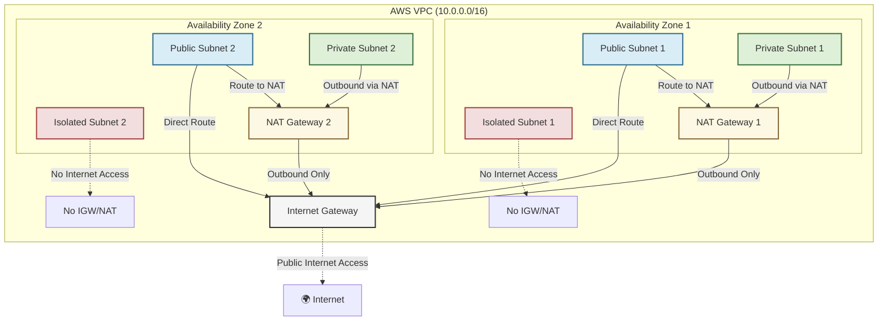

# 🏗 VPC Module

This module provisions a **highly available Virtual Private Cloud (VPC)** with a structured network layout. It creates a VPC along with **public, private, and isolated subnets**, an **Internet Gateway**, **NAT Gateways**, **route tables**, and a **default security group**.

---

## 📖 Overview

This module enables a networking solution by creating a VPC with a well-structured layout that segregates traffic based on its needs. Public subnets accommodate internet-facing resources like NAT Gateways and load balancers, while private subnets host internal workloads that require outbound connectivity. Isolated subnets ensure that sensitive systems remain completely offline. Core components, including the Internet Gateway, NAT Gateways, and a default security group—work together to manage traffic flow and enforce strict intra-VPC communication across multiple Availability Zones for enhanced redundancy and high availability.



---

## 🛠 Resources Used

| Resource                                                                                                               | Description                                                     | Documentation                                                                                  |
| ---------------------------------------------------------------------------------------------------------------------- | --------------------------------------------------------------- | ---------------------------------------------------------------------------------------------- |
| [`aws_vpc`](https://registry.terraform.io/providers/hashicorp/aws/latest/docs/resources/vpc)                           | Creates a new VPC with DNS support and hostnames                | [Amazon VPC](https://docs.aws.amazon.com/vpc/latest/userguide/what-is-amazon-vpc.html)         |
| [`aws_internet_gateway`](https://registry.terraform.io/providers/hashicorp/aws/latest/docs/resources/internet_gateway) | Provides internet connectivity for public subnets               | [Internet Gateway](https://docs.aws.amazon.com/vpc/latest/userguide/VPC_Internet_Gateway.html) |
| [`aws_subnet`](https://registry.terraform.io/providers/hashicorp/aws/latest/docs/resources/subnet)                     | Creates public, private, and isolated subnets within the VPC    | [Subnets](https://docs.aws.amazon.com/vpc/latest/userguide/VPC_Subnets.html)                   |
| [`aws_nat_gateway`](https://registry.terraform.io/providers/hashicorp/aws/latest/docs/resources/nat_gateway)           | Provides outbound internet access to private subnets            | [NAT Gateways](https://docs.aws.amazon.com/vpc/latest/userguide/vpc-nat-gateway.html)          |
| [`aws_route_table`](https://registry.terraform.io/providers/hashicorp/aws/latest/docs/resources/route_table)           | Defines custom routes for public, private, and isolated subnets | [Route Tables](https://docs.aws.amazon.com/vpc/latest/userguide/VPC_Route_Tables.html)         |
| [`aws_security_group`](https://registry.terraform.io/providers/hashicorp/aws/latest/docs/resources/security_group)     | Default security group restricting access                       | [Security Groups](https://docs.aws.amazon.com/vpc/latest/userguide/VPC_SecurityGroups.html)    |

---

## ⚙️ Usage

Include this module in your Terraform configuration:

```hcl
module "vpc" {
  source      = "./modules/vpc"
  cidr_block  = "10.0.0.0/16"
  az_count    = 2
  subnet_bits = 8
  prefix      = "myproject"
  tags        = {
    Environment = "prod"
    Owner       = "team"
  }
}
```

---

## 🔑 Inputs

| Name          | Description                                       | Type        | Default | Required |
| ------------- | ------------------------------------------------- | ----------- | ------- | :------: |
| `cidr_block`  | The CIDR block for the VPC                        | string      | n/a     |  ✅ Yes  |
| `az_count`    | Number of Availability Zones to use               | number      | n/a     |  ✅ Yes  |
| `subnet_bits` | Extra bits for subnet division (e.g., /16 -> /24) | number      | n/a     |  ✅ Yes  |
| `prefix`      | Prefix for resource names                         | string      | n/a     |  ✅ Yes  |
| `tags`        | Common tags for resources                         | map(string) | {}      |  ❌ No   |

---

## 📤 Outputs

| Name               | Description                      |
| ------------------ | -------------------------------- |
| `vpc_id`           | The ID of the created VPC        |
| `public_subnets`   | List of public subnet IDs        |
| `private_subnets`  | List of private subnet IDs       |
| `isolated_subnets` | List of isolated subnet IDs      |
| `private_rt_id`    | ID of the private route table    |
| `isolated_rt_id`   | ID of the isolated route table   |
| `default_sg_id`    | ID of the default security group |

---

## 🌍 Notes

- **Subnet Division:**  
  The module uses `cidrsubnet` to divide the VPC into multiple tiers of subnets:
  - Public subnets:  
    `cidrsubnet(var.cidr_block, var.subnet_bits, count.index)`
  - Private subnets (offset by 100):  
    `cidrsubnet(var.cidr_block, var.subnet_bits, count.index + 100)`
  - Isolated subnets (offset by 200):  
    `cidrsubnet(var.cidr_block, var.subnet_bits, count.index + 200)`
- **Security Considerations:**
  - The **default security group** only allows intra-VPC traffic.
  - You can attach **custom security groups** to restrict or allow external access.
